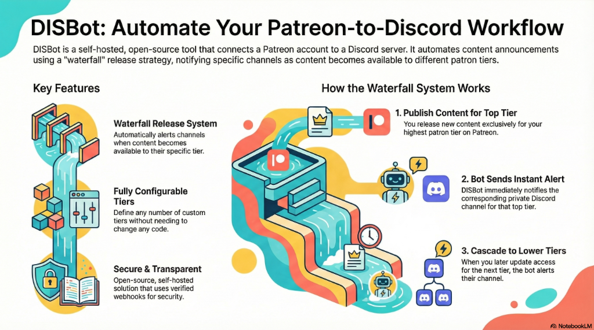

# 🤖 Patreon Tier-Waterfall Discord Bot

A Discord bot that automates content distribution from Patreon to Discord using a tiered "waterfall" release strategy. The bot tracks when content becomes available to different patron tiers and notifies the appropriate Discord channels in real-time.



## ✨ Features

- **🎯 Waterfall Release System**: Automatically alerts Discord channels when content becomes available to their tier
- **👥 Member Tracking**: Monitors new pledges, upgrades, and departures
- **🔒 Secure Admin Panel**: User ID-based authentication for admin commands
- **📊 Real-time Webhooks**: Instant notifications via Patreon webhooks
- **💎 Tier Management**: Easy mapping of Patreon tiers to Discord channels
- **⚙️ Configuration-Driven**: 100% configurable via environment variables (no code changes needed!)
- **🔄 Dynamic Tier System**: Support for any number of custom tiers via JSON configuration

## 📚 Documentation

- **[Setup Guide](SETUP.md)** - Detailed setup instructions for Discord, Patreon, and Supabase
- **[Deployment Guide](RENDER_DEPLOYMENT.md)** - Deploy to Render.com with automatic HTTPS
- **[Contributing Guide](CONTRIBUTING.md)** - How to contribute to this project
- **[Code of Conduct](CPDSC.md)** - Community guidelines and standards

## 🚀 Quick Start

### Prerequisites

- Node.js 18+ and npm
- A Discord bot token ([Create one here](https://discord.com/developers/applications))
- A Patreon Creator account with OAuth app ([Setup guide](https://www.patreon.com/portal/registration/register-clients))
- A Supabase account ([Sign up here](https://supabase.com))
- A server with HTTPS support for webhooks (Render, Railway, ngrok, etc.)

### Installation

1. **Clone the repository**
   ```bash
   git clone <repository-url>
   cd DISBot
   ```

2. **Install dependencies**
   ```bash
   npm install
   ```

3. **Configure environment variables**
   ```bash
   cp .env.example .env
   # Edit .env with your credentials
   ```

4. **Set up Supabase database**
   - Create a new Supabase project
   - Run the SQL migration from `supabase/migrations/`
   - Copy your Supabase URL and anon key to `.env`

5. **Configure your tiers (Automated Method)**
   
   Run the automated setup tool to fetch your tier configuration:
   ```bash
   npm run setup:patreon
   ```
   
   This will output:
   - Your `PATREON_CAMPAIGN_ID`
   - A ready-to-use `TIER_CONFIG` JSON string with all tier IDs and prices
   
   Copy the output into your `.env` file and update the `rank` values:
   ```bash
   TIER_CONFIG='[{"name":"Diamond","id":"12345678","rank":100,"cents":2500},{"name":"Gold","id":"87654321","rank":75,"cents":1500}]'
   ```
   
   **Rank Guidelines:**
   - Higher rank = Higher tier (e.g., 100 for Diamond)
   - Lower rank = Lower tier (e.g., 25 for Bronze)
   - Free tier = 0

6. **Build the project**
   ```bash
   npm run build
   ```

7. **Deploy slash commands**
   ```bash
   npm run deploy-commands
   ```

8. **Start the bot**
   ```bash
   npm start
   # For development with auto-reload:
   npm run dev
   ```

## ⚙️ Configuration

### Environment Variables

Create a `.env` file with the following variables:

```env
# Discord Configuration
DISCORD_TOKEN=your_discord_bot_token
GUILD_ID=your_discord_server_id
ROOT_ADMIN_ID=your_discord_user_id
LOG_CHANNEL_ID=channel_for_logs (optional)

# Patreon Configuration
PATREON_CLIENT_ID=your_patreon_client_id
PATREON_CLIENT_SECRET=your_patreon_client_secret
PATREON_ACCESS_TOKEN=your_patreon_access_token
PATREON_REFRESH_TOKEN=your_patreon_refresh_token
PATREON_CAMPAIGN_ID=your_campaign_id

# Webhook Configuration
WEBHOOK_SECRET=your_webhook_secret
WEBHOOK_PORT=3000

# Supabase Configuration
SUPABASE_URL=https://your-project.supabase.co
SUPABASE_KEY=your_supabase_anon_or_service_key

# Tier Configuration (JSON array)
# Format: [{"name":"TierName","id":"PatreonTierID","rank":RankNumber,"cents":AmountInCents}]
# Rank: 100 = Highest priority, 0 = Free
# cents: Optional pledge amount in cents for fallback tier detection
TIER_CONFIG='[{"name":"Tier1","id":"TIER_ID_1","rank":100,"cents":2500},{"name":"Tier2","id":"TIER_ID_2","rank":75,"cents":1500}]'
```

### Tier Configuration

The bot uses a dynamic tier system configured via the `TIER_CONFIG` environment variable:

**JSON Structure:**
```json
[
  {
    "name": "YourTierName",
    "id": "PatreonTierID",
    "rank": 100,
    "cents": 2500
  }
]
```

- **name**: Tier name used in `/admin set-channel` commands
- **id**: Patreon tier ID (found using tool setup:patreon)
- **rank**: Priority level (100 = highest, 0 = free)
- **cents**: (Optional) Minimum pledge amount in cents for fallback tier detection

**Examples:**

Standard 5-tier setup with cents fallback:
```bash
TIER_CONFIG='[{"name":"Tier1","id":"TIER_ID_1","rank":100,"cents":2500},{"name":"Tier2","id":"TIER_ID_2","rank":75,"cents":1500},{"name":"Tier3","id":"TIER_ID_3","rank":50,"cents":1000},{"name":"Tier4","id":"TIER_ID_4","rank":25,"cents":300},{"name":"Tier5","id":"TIER_ID_5","rank":0,"cents":0}]'
```

Custom tier names:
```bash
TIER_CONFIG='[{"name":"Captain","id":"123","rank":100},{"name":"Crew","id":"456","rank":50}]'
```

### Initial Setup

1. **Invite the bot to your server** with these permissions:
   - Send Messages
   - Embed Links
   - Use Slash Commands

2. **Configure tier mappings** using `/admin set-channel`:
   ```
   /admin set-channel tier_name:Tier1 channel:#tier1-alerts
   /admin set-channel tier_name:Tier2 channel:#tier2-alerts
   ```

3. **Test the setup**:
   ```
   /admin status
   /admin test-alert tier_name:Tier1
   ```

## 📚 Admin Commands

All admin commands are restricted to the user specified in `ROOT_ADMIN_ID`.

| Command | Description |
|---------|-------------|
| `/admin status` | Display bot status and configuration |
| `/admin set-channel <tier> <channel>` | Map a Patreon tier to a Discord channel |
| `/admin set-owner <user>` | Transfer bot control to another user |
| `/admin test-alert <tier>` | Send a test alert to verify setup |

## 🔄 How It Works

### Waterfall Release Strategy

1. **New Content**: When you publish content for Tier1, the bot alerts #tier1-alerts
2. **Tier Update**: When you change access from Tier1 to Tier2, the bot alerts #tier2-alerts
3. **Cascade**: Continue lowering tiers, and each channel gets notified when they gain access

### Tier Detection

The bot uses multiple methods to detect post tiers:

1. **Tier ID Translation**: Converts Patreon tier IDs to tier names using `TIER_CONFIG`
2. **Included Data Lookup**: Searches for tier information in webhook payload
3. **Pledge Amount Fallback**: Uses `min_cents_pledged_to_view` as last resort

### Member Tracking

- **New Pledge**: Bot logs new members and their tier
- **Upgrade**: Bot detects and celebrates tier upgrades
- **Departure**: Bot logs when members end their pledge

## 🛠️ Development

### Project Structure

```
src/
├── commands/           # Slash command handlers
│   ├── admin/         # Admin-only commands
│   └── deploy-commands.ts
├── database/          # Database layer (Supabase)
│   ├── db.ts         # Database operations
│   └── schema.ts     # TypeScript interfaces
├── middleware/        # Authorization middleware
├── utils/            # Utility functions
│   ├── embedBuilder.ts
│   ├── logger.ts
│   └── tierRanking.ts  # Dynamic tier system
├── webhooks/         # Webhook server and handlers
│   ├── handlers/     # Event-specific handlers
│   ├── server.ts
│   └── verify.ts
├── config.ts         # Configuration management
└── index.ts          # Main entry point
```

### Scripts

- `npm run dev` - Start with hot reload
- `npm run build` - Compile TypeScript
- `npm start` - Run production build
- `npm run deploy-commands` - Register slash commands
- `npm test` - Run tests

## 🚢 Deployment

### Render Deployment

1. Create a new Web Service on Render
2. Connect your GitHub repository
3. Set environment variables in Render dashboard
4. Deploy!

See [RENDER_DEPLOYMENT.md](RENDER_DEPLOYMENT.md) for detailed instructions.

### Docker Deployment

```bash
docker build -t patreon-bot .
docker run -d --env-file .env patreon-bot
```

## 🔐 Security

- **User ID Whitelisting**: Only the root admin can execute admin commands
- **Webhook Verification**: All Patreon webhooks are verified using HMAC signatures
- **Environment Variables**: Sensitive data stored in `.env` (never committed)
- **Supabase RLS**: Row-level security policies protect database access

## ❓ Frequently Asked Questions

### 🛡️ Privacy & Transparency

**Q: Is this bot completely transparent? How do I know it's safe?**

A: Yes. This project is released under the MIT License, which is a permissive open-source license. This means the entire codebase—from the database logic to the webhook handlers—is fully visible and free for you to audit. Nothing is obfuscated or hidden in compiled binaries; what you see in the `src/` folder is exactly what runs on your server.

**Q: Does the bot collect my data or send it to the developer?**

A: No. This is a strictly self-hosted solution.
- **Data Flow**: The bot acts as a direct bridge between your Patreon and your Discord. Data flows from Patreon's webhooks directly to your hosted instance.
- **Storage**: All data, including channel mappings and member tracking, is stored in your Supabase database (PostgreSQL). No data is ever transmitted to the bot creator or any third-party analytics services.

**Q: How is my Patreon data secured?**

A: Security is handled through multiple layers:
1. **Environment Variables**: Sensitive credentials (like your `DISCORD_TOKEN` and `PATREON_ACCESS_TOKEN`) are stored in a `.env` file or your cloud provider's secure environment dashboard. They are never hardcoded into the source code.
2. **Webhook Verification**: The bot uses your `WEBHOOK_SECRET` to verify an HMAC signature on every request. This ensures the bot only accepts data that genuinely comes from Patreon.
3. **Supabase RLS**: Row-level security policies protect your database from unauthorized access.

### ⚙️ Configuration & Tiers

**Q: Is this bot hardcoded for specific tiers like "Diamond" or "Gold"?**

A: No. While the default examples use these names, the system is 100% configuration-driven. You define your own tier hierarchy using a standard JSON format in your environment variables (`TIER_CONFIG`). Whether you have 2 tiers or 20, and whatever you choose to name them, the bot adapts automatically without requiring code changes.

**Q: How does the bot know which tier is which?**

A: It uses a smart "Waterfall" logic with three layers of detection to ensure notifications never fail:
1. **ID Match (Primary)**: It checks the unique Tier ID from Patreon using the `tierIdMap`.
2. **Price Fallback (Secondary)**: If the ID is missing, it checks the `min_cents_pledged_to_view` (e.g., 2500 cents = $25.00) using the `centsMap`.
3. **Title Match (Legacy)**: As a last resort, it attempts to match the tier title text from the `included` data.

**Q: What happens when I update a post (e.g., from "Diamond" to "Gold")?**

A: The bot detects the update and calculates the **lowest** tier that now has access (widest audience). For example, if a post was Diamond-only and you add Gold access, the bot identifies Gold as the new audience and sends the waterfall alert specifically to the Gold channel. This is the core "waterfall" feature.

**💡 Pro Tip: The "Invisible Space" Trick**

Sometimes, when you only change the "Who can access this post?" settings (e.g., checking the box for Gold), Patreon's website may not immediately trigger the `posts:update` webhook. If the webhook isn't sent, the bot cannot detect the change.

**To force the update without altering your content:**
1. Open the Post: Go to the edit screen of your existing post
2. Change Access: Check the box for the new lower tier (e.g., Gold)
3. **The Trick**: Click inside your Post Title and add a single space at the very end
4. Click Update/Publish

**Why this works**: To your readers, "My Post Title" and "My Post Title " look exactly the same—the browser renders them identically. However, Patreon's server sees a difference in the text string. This forces Patreon to mark the post as "modified" and immediately send the `posts:update` signal to your bot, triggering the waterfall logic.

### ☁️ Deployment

**Q: Can I run this on cloud services like Render or Heroku?**

A: Yes. The project follows "12-Factor App" principles, meaning all configuration is handled via Environment Variables, making it cloud-ready.
- **Database**: The bot uses Supabase (PostgreSQL), which is a cloud database service. Your data persists across deployments and restarts automatically.
- **Recommended**: See [RENDER_DEPLOYMENT.md](RENDER_DEPLOYMENT.md) for step-by-step deployment instructions.

**Q: What do I need to get started?**

A: You need:
- Node.js 18+
- A Discord Bot Token ([Create one here](https://discord.com/developers/applications))
- A Patreon Creator account with OAuth app
- A Supabase account (free tier available)
- A server with HTTPS support for webhooks (Render, Railway, VPS, etc.)

See [SETUP.md](SETUP.md) for detailed setup instructions.

## 🆕 Recent Updates

- ✅ **Dynamic Tier Configuration**: Configure tiers via `TIER_CONFIG` environment variable
- ✅ **Tier ID Translation**: Automatic conversion of Patreon tier IDs to tier names
- ✅ **Supabase Integration**: Migrated from SQLite to Supabase for persistent storage
- ✅ **Enhanced Logging**: Comprehensive debug logging for tier detection
- ✅ **Fallback Mechanisms**: Multiple methods to detect post tiers

## 📝 License

MIT

## 🤝 Support

For issues or questions, please open an issue on GitHub.

## 🙏 Acknowledgments

Built with ❤️ for Patreon creators who want to automate their content distribution workflow.
