<p align="center">
  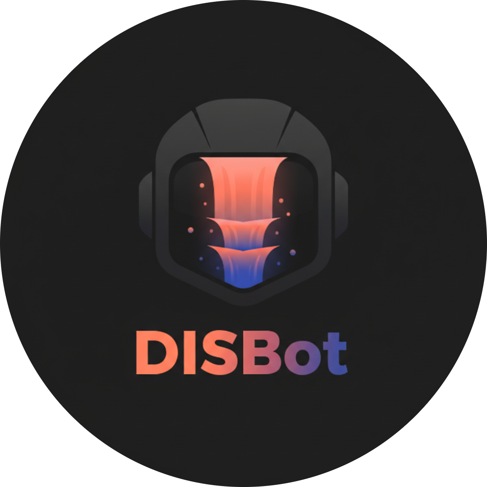
</p>

# DISBot — Intelligent Content Distribution

<p align="center">
  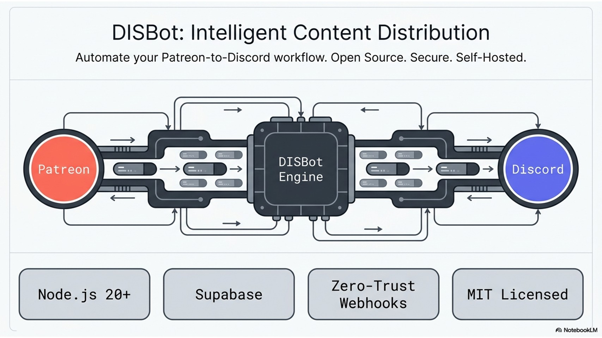
</p>

<p align="center">
  <strong>Automate your Patreon-to-Discord workflow.</strong> Open Source · Secure · Self-Hosted.
</p>

<p align="center">
  <a href="https://railway.app/new/template/disbot?referralCode=nLfB6T">
    
  </a>
</p>

---

<p align="center">
  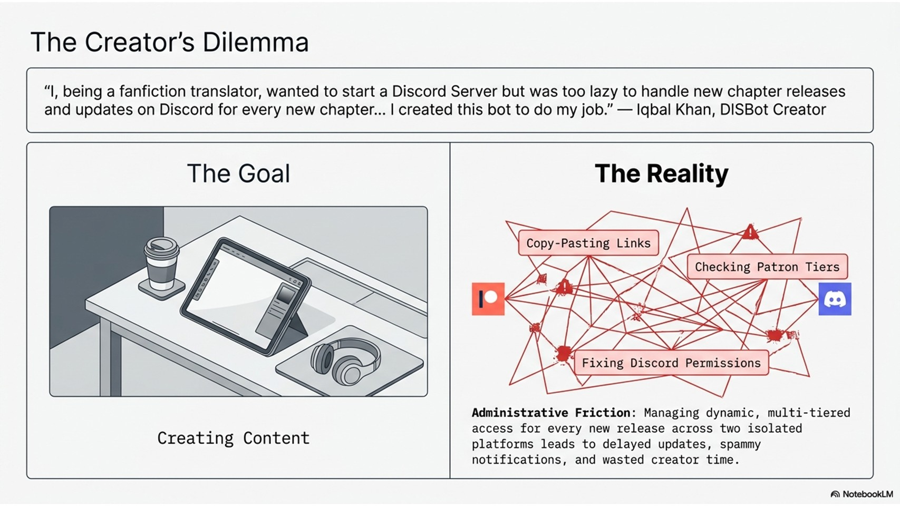
</p>

## ✨ Features

### 🏗️ Architecture

<p align="center">
  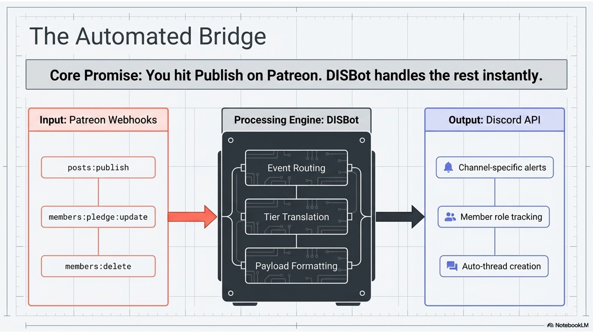
</p>

### 🌟 Core Features
- **🎯 Waterfall Release System**: Smart, tiered content distribution that prevents spam
- **⚡ Hybrid Broadcast System**: Detects multi-tier releases and alerts all relevant channels simultaneously
- **👥 Member Tracking**: Logs new pledges, upgrades, and departures to Supabase
- **🔄 Automated Role Sync**: Auto-grants/revokes Discord roles based on Patreon tier changes
- **📊 Web Analytics Dashboard**: JWT-gated Chart.js SPA with patron growth, tier distribution, and activity
- **🔒 Zero-Trust Security**: HMAC webhook verification, Row-Level Security, whitelist-protected admin commands
- **💎 Dynamic Tier System**: Configurable via JSON or live-synced from the Patreon API
- **🗄️ Graceful Degradation**: In-memory DB cache keeps the bot running if Supabase goes offline

<p align="center">
  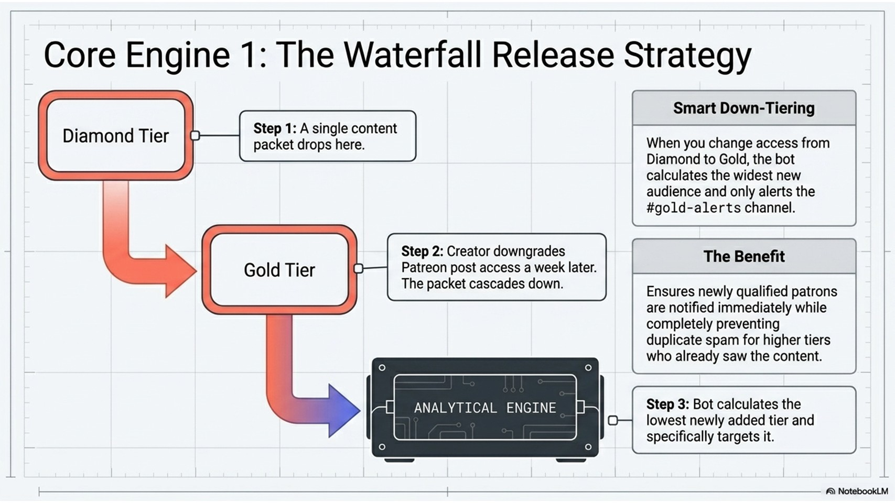
</p>

### 🛠️ Setup & Deployment
- **🧙 Setup Wizard GUI**: `npm run setup:wizard` launches a local HTML dashboard for frictionless first-time setup
- **🎩 Interactive Discord Setup**: Wizard generates exact invite URL with all scopes/permissions pre-selected
- **📡 Automated Webhook Creation**: Setup wizard auto-creates Patreon webhooks with all 9 triggers via API
- **🎯 Drag-and-Drop Tier Ranker**: Visual tier priority cards in wizard — no JSON editing needed
- **📝 Visual Template Editor**: Drag-and-drop placeholders with live Discord embed preview in wizard
- **🚂 Railway Domain Auto-Detection**: Dynamically detects Railway public domains during cloud setup mode for 1-click Patreon config
- **🚀 1-Click Railway Deploy**: Deploy button in README auto-provisions the entire app with env var form
- **🚀 One-Command VPS Setup**: `setup-vps.sh` installs Node.js, PM2, Caddy (auto-HTTPS) in a single script
- **🐳 Self-Contained Docker Compose**: Full stack (bot + PostgreSQL + PostgREST) — no Supabase Cloud needed
- **🚇 Zero-Auth Local Tunnels**: `npm run dev:tunnel` — no ngrok account required (uses localtunnel)
- **🔨 Auto-Capture IDs**: Type `!claim` in any channel — bot captures Guild ID, Admin ID, Channel ID automatically
- **🎉 First-Deploy Welcome DM**: Interactive onboarding DM with setup checklist on first deployment

### 💬 Community & Engagement
- **💬 Custom Message Templates**: Fully customizable with placeholders (`{tier}`, `{title}`, `{url}`, `{user}`, `{post_snippet}`, `{pledge_amount}`, `{patron_count}`)
- **🧵 Auto-Thread Creation**: Optionally creates discussion threads under post alerts to keep channels clean
- **🗑️ Silent Post Deletion**: Automatically removes deleted posts without spammy notifications
- **💌 Win-Back DMs**: Auto-DMs departing patrons with a customizable farewell message
- **🎂 Anniversary Celebrations**: Daily checker posts celebratory messages for 1yr/2yr pledge milestones
- **🔑 Keyword Detection**: Auto-replies to FAQ keywords ("next chapter?") when Message Content Intent is enabled
- **📖 Serialized Content Formatting**: Auto-detects "Chapter N" / "Part N" in titles for spoiler-tagged embeds

### 🤖 Automation & Management
- **🔀 Event Routing**: Route member events (joins, departures, upgrades) to specific Discord channels
- **📋 Interactive Setup**: `/admin setup` with dropdown menus for tier→channel mapping
- **🔧 Bulk Mapping Wizard**: `/admin bulk-map` maps all unmapped tiers in a guided sequence
- **🔄 Live Tier Sync**: `/admin sync-tiers` fetches tiers from Patreon API without restarting
- **🔐 OAuth Token Exchange**: Built-in `/oauth/start` route eliminates curl/Postman for token setup
- **🔄 Automatic Token Refresh**: `patreonClient.ts` auto-refreshes expired tokens on 401 errors
- **🌍 Currency-Aware Pledges**: Normalizes international currencies to USD cents for accurate tier detection
- **👻 Ghost Webhook Filter**: Silently discards duplicate webhooks with no meaningful state change
- **🔄 Poller Toggle**: `/admin poller` lets admins start/stop the background poller to save resources
- **🔗 `/link` Command**: Members self-link their Discord to Patreon via email/name for role sync
- **⌨️ Prefix Commands**: `!status` and `!help` as slash-command fallbacks

### 📊 Diagnostics & Analytics
- **📊 Patron Analytics**: `/admin stats` shows growth, tier distribution, and recent activity
- **📊 Weekly Digest**: Every Sunday, DMs root admin a detailed summary including cancellations and tier changes
- **📦 Data Export**: `/admin export-data` generates CSV files of all patron data and DMs them to the admin
- **🖥️ Server Monitoring**: `/admin server-stats` shows live CPU, memory, uptime, and PM2 info
- **🔍 In-Discord Debug Logs**: `/admin debug-logs` shows the last 50 X-Ray log entries without leaving Discord
- **🕵️ Enhanced Diagnostics**: `/admin status` shows API latency, uptime, webhook stats, and tier detection accuracy
- **🧪 Template Preview**: `/admin test-alert <tier> <template_type>` previews custom templates with sample data
- **🛡️ Proactive Fallback Warnings**: DMs admin when tier detection falls back to cents/title matching
- **⚠️ Tier Rank Validation**: Warns on startup if cheaper tiers outrank expensive tiers in config
- **🔬 Startup Scope Validation**: Verifies Patreon OAuth token scopes on boot, warns if missing
- **🩺 Startup Health Checks**: Verifies Server Members Intent + Patreon webhook registration on boot
- **🏗️ Auto DB Migrations**: Runs pending SQL migrations automatically on startup
- **💥 HMAC Webhook Tester**: `npm run test:webhook` sends properly signed mock payloads to your endpoint
- **💾 SQLite Fallback Database**: Zero-config embedded DB when Supabase is not configured

### 🚀 Performance & Scalability
- **⚡ Fastify Server**: Express replaced with Fastify for 2–3× webhook throughput
- **📬 BullMQ + Redis Queue**: Webhook events queued via BullMQ for controlled concurrency, with auto-fallback to direct processing when Redis is unavailable
- **🗄️ Redis-Backed Caching**: Distributed cache layer enables horizontal scaling across multiple instances
- **📝 Batched DB Writes**: Member upserts buffered and flushed every 5 seconds to reduce Supabase load
- **📋 Webhook Event Cache**: Every verified webhook persisted to `webhook_log` table for audit, replay, and missed-announcement recovery
- **🔀 Centralized Event Router**: Extracted webhook routing for reuse by both Fastify (direct) and BullMQ worker (queued)
- **🚨 Smart Error Buffer**: In-memory error log with severity classification, cause/fix explanations, and `/admin error-log` viewer

<p align="center">
  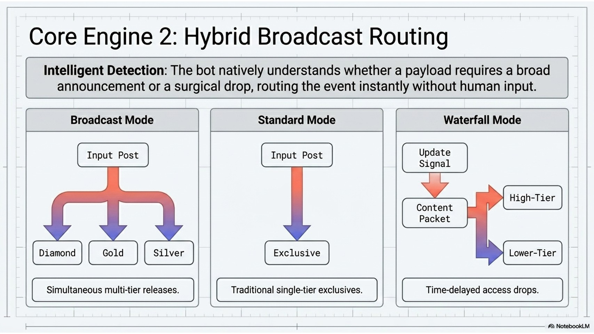
</p>

## 📚 Documentation

- **[Setup Guide](SETUP.md)** — Detailed setup instructions for Discord, Patreon, and Supabase
- **[Deployment Guide](DEPLOYMENT.md)** — Deploy to Railway, Render, Heroku, VPS, or run locally
- **[Contributing Guide](CONTRIBUTING.md)** — How to contribute to this project
- **[Code of Conduct](CPDSC.md)** — Community guidelines and standards

### 📖 Wiki (Maintainer Knowledge Base)

| Page | Description |
|------|-------------|
| [Home](docs/wiki/Home.md) | Index, 30-second overview, tech stack, repo orientation |
| [Architecture](docs/wiki/Architecture.md) | Boot sequence, component diagram, graceful degradation |
| [Diagrams](docs/wiki/Diagrams.md) | Mermaid graphs: system overview, webhook lifecycle, waterfall, data layers, module map |
| [Configuration](docs/wiki/Configuration.md) | All env vars, `TIER_CONFIG`, `METRICS_TOKEN`, setup mode |
| [Webhook Pipeline](docs/wiki/Webhook-Pipeline.md) | Ingestion lifecycle: verify → log → filter → queue → route → replay |
| [Tiers & Waterfall](docs/wiki/Tiers-and-Waterfall.md) | 5-layer tier detection cascade, ranks, waterfall mechanics, hybrid broadcast |
| [Commands](docs/wiki/Commands.md) | All 18 `/admin` subcommands + `/link` reference |
| [Database](docs/wiki/Database.md) | 7 tables, migrations, Supabase/SQLite adapters, batch writer |
| [Monitoring](docs/wiki/Monitoring.md) | `/metrics` endpoint, analytics dashboard, diagnostics, replay tooling |
| [Deployment](docs/wiki/Deployment.md) | Runtime model, hosting targets, gotchas |
| [Development](docs/wiki/Development.md) | Testing, conventions, extension points, i18n, known tech debt |

## 🚀 Quick Start

### Prerequisites

- Node.js 20+ and npm
- A Discord bot token ([Create one here](https://discord.com/developers/applications))
- A Patreon Creator account with OAuth app ([Setup guide](https://www.patreon.com/portal/registration/register-clients))
- A Supabase account ([Sign up here](https://supabase.com))
- A server with HTTPS support for webhooks (Railway, Render, ngrok, etc.)

### Installation

1. **Clone the repository**
   ```bash
   git clone <repository-url>
   cd DISBot
   ```

2. **Install dependencies**
   ```bash
   npm install
   ```

3. **Configure environment** (choose one):

   **Option A — Cloud Setup Wizard (Recommended)**:
   You don't need any terminal commands! Just add your Discord Bot Token to `.env` or your hosting provider's variables:
   ```env
   DISCORD_TOKEN=your_bot_token_here
   ```
   Start the bot (`npm start`). It will detect it's missing configuration and launch the Cloud Wizard. Visit `http://localhost:3000/setup` (or your Railway URL) to finish setup via the web UI!

   **Option B — Local Setup Wizard**:
   ```bash
   npm run setup:wizard
   ```
   Opens a local HTML dashboard at `http://localhost:3456/wizard` with buttons for Patreon OAuth, Supabase testing, and `.env` auto-writing.

   **Option C — Manual `.env`**:
   ```bash
   cp .env.example .env
   # Edit .env with your credentials
   ```

4. **Set up Supabase database**
   - Create a new Supabase project
   - Database migrations run **automatically on first boot** — no manual SQL needed
   - Follow the Cloud Wizard steps to add your Supabase URL and service_role key.

5. **Configure your tiers (Automated Method)**
   
   Set your Creator Access Token in `.env`, then run:
   ```bash
   npm run setup:patreon
   ```
   
   > **How to get the Creator Access Token:** Go to the [Patreon Clients Portal](https://www.patreon.com/portal/registration/register-clients) → click your app → copy the **"Creator's Access Token"** value.
   
   The script will:
   - Fetch your `PATREON_CAMPAIGN_ID` automatically
   - Display a formatted table of all your tiers with prices and patron counts
   - **Auto-write** `TIER_CONFIG`, `PATREON_CAMPAIGN_ID`, and `WEBHOOK_SECRET` directly to `.env`
   - Auto-assign ranks (highest-priced = 100)

6. **Build the project**
   ```bash
   npm run build
   ```

7. **Deploy slash commands**
   ```bash
   npm run deploy-commands
   ```

8. **Start the bot**
   ```bash
   npm start
   # For development with auto-reload:
   npm run dev
   ```

## ⚙️ Configuration

### Environment Variables

Create a `.env` file with the following variables:

```env
# Discord Configuration
DISCORD_TOKEN=your_discord_bot_token
GUILD_ID=your_discord_server_id
ROOT_ADMIN_ID=your_discord_user_id
LOG_CHANNEL_ID=channel_for_logs (optional)

# Patreon Configuration
PATREON_CLIENT_ID=your_patreon_client_id
PATREON_CLIENT_SECRET=your_patreon_client_secret
PATREON_ACCESS_TOKEN=your_patreon_access_token
PATREON_REFRESH_TOKEN=your_patreon_refresh_token
PATREON_CAMPAIGN_ID=your_campaign_id

# Webhook Configuration
WEBHOOK_SECRET=your_webhook_secret
WEBHOOK_PORT=3000

# Supabase Configuration
SUPABASE_URL=https://your-project.supabase.co
SUPABASE_KEY=your_supabase_anon_or_service_key

# Tier Configuration (JSON array)
# Format: [{"name":"TierName","id":"PatreonTierID","rank":RankNumber,"cents":AmountInCents}]
# Rank: 100 = Highest priority, 0 = Free
# cents: Optional pledge amount in cents for fallback tier detection
TIER_CONFIG='[{"name":"Tier1","id":"TIER_ID_1","rank":100,"cents":2500},{"name":"Tier2","id":"TIER_ID_2","rank":75,"cents":1500}]'
```

### Tier Configuration

The bot uses a dynamic tier system configured via the `TIER_CONFIG` environment variable:

**JSON Structure:**
```json
[
  {
    "name": "YourTierName",
    "id": "PatreonTierID",
    "rank": 100,
    "cents": 2500
  }
]
```

- **name**: Tier name used in `/admin set-channel` commands
- **id**: Patreon tier ID (found using tool setup:patreon)
- **rank**: Priority level (100 = highest, 0 = free)
- **cents**: (Optional) Minimum pledge amount in cents for fallback tier detection

**Examples:**

Standard 5-tier setup with cents fallback:
```bash
TIER_CONFIG='[{"name":"Tier1","id":"TIER_ID_1","rank":100,"cents":2500},{"name":"Tier2","id":"TIER_ID_2","rank":75,"cents":1500},{"name":"Tier3","id":"TIER_ID_3","rank":50,"cents":1000},{"name":"Tier4","id":"TIER_ID_4","rank":25,"cents":300},{"name":"Tier5","id":"TIER_ID_5","rank":0,"cents":0}]'
```

Custom tier names:
```bash
TIER_CONFIG='[{"name":"Captain","id":"123","rank":100},{"name":"Crew","id":"456","rank":50}]'
```

### Initial Setup

1. **Invite the bot to your server** with these permissions:
   - Send Messages
   - Embed Links
   - Use Slash Commands

2. **Enable Privileged Gateway Intents** in the [Discord Developer Portal](https://discord.com/developers/applications):
   - ✅ **Server Members Intent** (required)
   - ✅ Message Content Intent (optional)

3. **Configure tier mappings** using `/admin set-channel`:
   ```
   /admin set-channel tier_name:Tier1 channel:#tier1-alerts
   /admin set-channel tier_name:Tier2 channel:#tier2-alerts
   ```

4. **Test the setup**:
   ```
   /admin status
   /admin test-alert tier_name:Tier1
   ```

## 📚 Admin Commands

All admin commands are restricted to the user specified in `ROOT_ADMIN_ID`.

| Command | Description |
|---------|-------------|
| `/admin status` | Display bot status, config, API latency, and tier accuracy |
| `/admin set-channel <tier> <channel>` | Map a Patreon tier to a Discord channel |
| `/admin set-message <type> <content>` | Customize bot message templates |
| `/admin set-owner <user>` | Transfer bot control to another user |
| `/admin test-alert <tier>` | Send a test alert to verify setup |
| `/admin sync-tiers` | Live-sync tiers from Patreon API |
| `/admin setup` | Interactive tier→channel mapping wizard |
| `/admin bulk-map` | Map all unmapped tiers in a guided sequence |
| `/admin stats` | View patron growth, tier distribution, recent activity |
| `/admin set-event-channel <event> <channel>` | Route member events to specific channels |
| `/admin debug-logs` | View last 50 X-Ray debug log entries |
| `/admin export-data` | Export patron data as CSV files via DM |
| `/admin poller <action>` | Start, stop, or check the Patreon post poller |
| `/admin server-stats` | Live CPU, memory, uptime, and PM2 monitoring |
| `/admin role-map <action>` | Toggle role sync (on/off/status) and map tiers to Discord roles |
| `/admin dashboard` | Generate a time-limited JWT link to the web analytics dashboard |
| `/admin error-log [severity] [count]` | View recent errors with cause/fix explanations, filter by severity |
| `/link <email_or_name>` | (User command) Link your Discord account to your Patreon membership |

## 🔄 How It Works

### Waterfall Release Strategy

1. **New Content**: When you publish content for Tier1, the bot alerts #tier1-alerts
2. **Tier Update**: When you change access from Tier1 to Tier2, the bot alerts #tier2-alerts
3. **Cascade**: Continue lowering tiers, and each channel gets notified when they gain access

### Tier Detection

The bot uses multiple methods to detect post tiers:

1. **Tier ID Translation**: Converts Patreon tier IDs to tier names using `TIER_CONFIG`
2. **Included Data Lookup**: Searches for tier information in webhook payload
3. **Pledge Amount Fallback**: Uses `min_cents_pledged_to_view` as last resort

### Hybrid Broadcast System

The bot intelligently handles multi-tier post releases:

**BROADCAST Mode** (Multiple Tiers):
- Post released to Diamond + Gold + Silver → All 3 channels get alerts
- Each tier sees their own customized notification
- Perfect for simultaneous multi-tier releases

**STANDARD Mode** (Single Tier):
- Post released to Diamond only → Only #diamond-chat gets alert
- Traditional single-channel notification

**WATERFALL Mode** (Updates):
- Edit post to add lower tiers → Only new tier gets alert
- Prevents spam by only notifying newly-added tiers

**Example:**
```
Day 1: Release to Diamond + Gold
→ Bot sends to #diamond-chat AND #gold-chat (BROADCAST)

Day 7: Edit to add Silver access
→ Bot sends ONLY to #silver-chat (WATERFALL)
```

### Custom Message Templates

Customize all bot messages using the `/admin set-message` command:

**Available Templates:**
- `post_new` - New post notifications
- `post_waterfall` - Waterfall update alerts
- `welcome` - Welcome messages for new patrons
- `win_back` - Farewell DM for departing patrons (placeholders: `{user}`, `{name}`)
- `anniversary` - Pledge anniversary celebrations (placeholders: `{user}`, `{years}`)

**Placeholders:**
- `{tier}` - Tier name (e.g., "Diamond", "Gold")
- `{title}` - Post title
- `{url}` - Post URL
- `{user}` - User mention (for welcome/win-back messages)
- `{post_snippet}` - First 200 chars of post content
- `{pledge_amount}` - Pledge amount (e.g., "$25.00")
- `{patron_count}` - Total patron count
- `{years}` - Anniversary year count

**Example:**
```
/admin set-message type:post_new content:🎉 New {tier} exclusive: {title} - {url}
/admin set-message type:win_back content:Hey {user}, thanks for your support! We'd love to have you back 💙
```

### Member Tracking

- **New Pledge**: Bot logs new members and their tier
- **Upgrade**: Bot detects and celebrates tier upgrades
- **Departure**: Bot logs when members end their pledge

## 🛠️ Development

### Project Structure

```
src/
├── commands/           # Slash command handlers
│   ├── admin/         # Admin-only commands
│   │   ├── handler.ts        # Command router
│   │   ├── set-channel.ts
│   │   ├── set-message.ts
│   │   ├── set-owner.ts
│   │   ├── status.ts
│   │   ├── test-alert.ts
│   │   ├── sync-tiers.ts
│   │   ├── setup.ts          # Interactive mapping wizard
│   │   ├── stats.ts          # Patron analytics
│   │   ├── bulk-map.ts
│   │   ├── set-event-channel.ts
│   │   ├── debug-logs.ts
│   │   ├── export-data.ts
│   │   ├── poller.ts         # Poller toggle command
│   │   ├── server-stats.ts   # Server monitoring
│   │   ├── role-map.ts       # Discord role sync management
│   │   ├── dashboard-cmd.ts  # JWT dashboard link generator
│   │   └── error-log.ts      # Severity-classified error viewer
│   ├── link.ts               # /link — user self-links Discord↔Patreon
│   ├── commandData.ts        # Shared command definitions
│   └── deploy-commands.ts
├── database/          # Database layer (Supabase)
│   ├── db.ts         # Database operations
│   ├── dbCache.ts    # In-memory cache for graceful degradation
│   ├── autoMigrate.ts # Automatic SQL migrations on startup
│   ├── batchWriter.ts # Batched member upserts (5s flush)
│   ├── redis.ts      # Redis connection manager
│   ├── schema.ts     # TypeScript interfaces
│   ├── webhookCache.ts # Webhook audit log + digest queries
│   └── supabase.ts   # Supabase client
├── queue/            # Message queue (BullMQ)
│   ├── webhookQueue.ts  # Queue producer (enqueue events)
│   └── webhookWorker.ts # Queue consumer (process events)
├── middleware/        # Authorization middleware
│   └── adminCheck.ts
├── utils/            # Utility functions
│   ├── anniversaryChecker.ts # Daily pledge anniversary detector
│   ├── chapterFormatter.ts  # Serialized content (Chapter/Part) formatting
│   ├── currencyHelper.ts    # International currency normalization
│   ├── embedBuilder.ts      # Discord embed creation
│   ├── errorHandler.ts      # Error handling
│   ├── formatter.ts         # Message template formatting
│   ├── keywordDetector.ts   # FAQ keyword auto-replies + prefix commands
│   ├── logger.ts            # Logging (console + Discord + error buffer)
│   ├── firstDeploy.ts       # First-deployment welcome DM
│   ├── healthChecks.ts      # Startup intent + webhook health checks
│   ├── roleSync.ts          # Discord role sync engine + reconciliation
│   ├── setupMode.ts         # Auto-capture Discord IDs (!claim)
│   ├── patreonClient.ts     # Axios wrapper with auto token-refresh
│   ├── patreonPoller.ts     # Background tier-change poller
│   ├── testHelpers.ts       # Webhook test utilities
│   ├── tierRanking.ts       # Dynamic tier system
│   └── weeklyDigest.ts      # Weekly patron digest scheduler
├── webhooks/         # Webhook server and handlers
│   ├── handlers/     # Event-specific handlers
│   │   ├── members-create.ts    # + win-back DMs on departure
│   │   ├── members-update.ts
│   │   ├── members-delete.ts
│   │   ├── members-pledge-create.ts
│   │   ├── members-pledge-update.ts
│   │   ├── members-pledge-delete.ts
│   │   ├── posts-publish.ts     # + chapter formatting
│   │   ├── posts-update.ts
│   │   └── posts-delete.ts
│   ├── dashboard.ts  # Chart.js analytics SPA (JWT-gated)
│   ├── router.ts     # Centralized webhook event router
│   ├── server.ts     # Fastify server + OAuth routes + ghost filter
│   ├── wizard.ts     # Cloud setup wizard plugin
│   └── verify.ts     # HMAC signature verification
├── config.ts         # Configuration + tier rank validation
└── index.ts          # Main entry point + startup orchestration
scripts/
├── setup-wizard.ts   # Local HTML setup dashboard (template editor + tier ranker)
├── test-webhook.ts   # HMAC-signed webhook tester (npm run test:webhook)
├── dev-tunnel.ts     # Zero-auth local tunnel (npm run dev:tunnel)
├── fetch-patreon-config.ts  # Auto-fetch tiers + write .env
└── dev-ngrok.ts      # Auto-tunnel for local development
setup-vps.sh          # One-command VPS setup (Caddy + PM2 + Node.js)
.github/
├── ISSUE_TEMPLATE/
│   ├── bug_report.md
│   └── feature_request.md
└── PULL_REQUEST_TEMPLATE.md
```

### Architecture

The bot follows an **early port-binding** architecture to work correctly on cloud platforms:

1. **Redis connection** → Connects to Redis if `REDIS_URL` is configured (optional)
2. **Supabase initialization** → Database connection test
3. **Auto-migrations** → Runs pending SQL migrations from `supabase/migrations/`
4. **Webhook server starts** → Fastify binds to `PORT` immediately (required by Railway/Render)
5. **BullMQ worker starts** → Queue consumer begins processing (if Redis is available)
6. **Discord client login** → Connects to Discord gateway
7. **Ready** → Auto-deploys slash commands, validates OAuth scopes, initializes DB cache, starts batch writer + poller + anniversary checker + weekly digest + role reconciliation

This startup order ensures cloud platforms detect the open port before the Discord gateway connection completes.

**Webhook Processing Pipeline:**
```
Patreon → HMAC Verify → Dedup Guard → Ghost Filter → Webhook Cache (audit log)
  ↓
  Redis available? → BullMQ Queue → Worker → Event Router → Handler
  Redis unavailable? → Direct Processing → Event Router → Handler
```

### Scripts

| Script | Description |
|--------|-------------|
| `npm run dev` | Start with hot reload (nodemon) |
| `npm run dev:ngrok` | Auto-tunnel local dev with ngrok |
| `npm run build` | Compile TypeScript |
| `npm start` | Run production build |
| `npm run deploy-commands` | Register slash commands (also auto-runs on startup) |
| `npm run setup:patreon` | Fetch tiers from Patreon + auto-write `.env` |
| `npm run setup:wizard` | Launch local HTML setup dashboard on port 3456 |
| `npm run test:webhook` | Send HMAC-signed mock webhook to test your endpoint |
| `npm test` | Run tests |
| `npm run verify` | Run deployment verification script |

## 🚢 Deployment

### ⚠️ Important: Hosting Compatibility

> **Render.com free tier does NOT work for Discord bots.** Render's free tier uses shared IP addresses that are rate-limited by Discord's Cloudflare protection (HTTP 429, error code 1015). The bot's gateway connection will hang indefinitely. Use Railway, a paid Render plan, or another platform instead.

### Railway (Recommended)

One-click deploy — click the button below or follow the manual steps.

[](https://railway.app/new/template/disbot?referralCode=nLfB6T)

**Manual steps:**
1. Go to [railway.app](https://railway.app) → Sign in with GitHub
2. **New Project** → **Deploy from GitHub repo** → select your repo
3. Add environment variables in the **Variables** tab
4. Railway auto-detects the `railway.json` config and deploys
5. Generate a domain in **Settings** → **Networking**
6. Update your Patreon webhook URL to `https://your-app.up.railway.app/webhooks/patreon`

**Why Railway?**
- ✅ Automatic HTTPS with free SSL
- ✅ No shared IP rate-limiting issues with Discord
- ✅ $5 free credit/month
- ✅ Fast deploys (~2-3 minutes)
- ✅ Auto-deploy from GitHub pushes

See [DEPLOYMENT.md](DEPLOYMENT.md) for all deployment options.

### Docker Compose (Self-Hosted)

Run everything locally or on your own VPS — **no Supabase Cloud account required**.

Docker Compose bundles PostgreSQL, PostgREST (REST API), and the bot together:

```bash
# 1. Configure
cp .env.example .env        # fill in Discord/Patreon credentials

# 2. Start all services
docker compose up -d

# 3. Register slash commands
docker compose exec bot npm run deploy-commands
```

The database is automatically initialized with all required tables on first start (`docker/init.sql`).

> **Note**: When using Docker Compose, `SUPABASE_URL` and `SUPABASE_KEY` are automatically overridden to point at the local PostgREST instance — you don't need a Supabase Cloud account.

### Docker Only (Bring Your Own Database)

If you already have a Supabase project or external PostgreSQL + PostgREST:

```bash
docker build -t patreon-bot .
docker run -d --env-file .env patreon-bot
```

The Dockerfile uses a multi-stage build with Node.js 20 Alpine for a lean production image.

## 🔐 Security

- **User ID Whitelisting**: Only the root admin can execute admin commands
- **Webhook Verification**: All Patreon webhooks are verified using HMAC signatures
- **Environment Variables**: Sensitive data stored in `.env` (never committed)
- **Supabase RLS**: Row-level security policies protect database access

## ❓ Frequently Asked Questions

### 🛡️ Privacy & Transparency

**Q: Is this bot completely transparent? How do I know it's safe?**

A: Yes. This project is released under the MIT License, which is a permissive open-source license. This means the entire codebase—from the database logic to the webhook handlers—is fully visible and free for you to audit. Nothing is obfuscated or hidden in compiled binaries; what you see in the `src/` folder is exactly what runs on your server.

**Q: Does the bot collect my data or send it to the developer?**

A: No. This is a strictly self-hosted solution.
- **Data Flow**: The bot acts as a direct bridge between your Patreon and your Discord. Data flows from Patreon's webhooks directly to your hosted instance.
- **Storage**: All data, including channel mappings and member tracking, is stored in your Supabase database (PostgreSQL). No data is ever transmitted to the bot creator or any third-party analytics services.

**Q: How is my Patreon data secured?**

A: Security is handled through multiple layers:
1. **Environment Variables**: Sensitive credentials (like your `DISCORD_TOKEN` and `PATREON_ACCESS_TOKEN`) are stored in a `.env` file or your cloud provider's secure environment dashboard. They are never hardcoded into the source code.
2. **Webhook Verification**: The bot uses your `WEBHOOK_SECRET` to verify an HMAC signature on every request. This ensures the bot only accepts data that genuinely comes from Patreon.
3. **Supabase RLS**: Row-level security policies protect your database from unauthorized access.

> ⚠️ **Git History Warning**: If any secret (Discord token, Patreon credentials, Supabase key, webhook secret, database password) was **ever** committed to this repository — even if it has since been removed — the old value is still recoverable from `git log`. You **must** rotate (regenerate) any such credential immediately:
> - **Discord Bot Token**: Discord Developer Portal → Bot → Reset Token
> - **Patreon Client Secret / Access Token**: Patreon Developer Portal → Reset or re-authorize via `/oauth/start`
> - **Supabase Keys**: Supabase Dashboard → Settings → API → Regenerate keys
> - **Webhook Secret**: Generate a new one: `node -e "console.log(require('crypto').randomBytes(32).toString('hex'))"`
> - **Database Passwords**: Change via your hosting provider's dashboard
>
> Old credentials in git history can be exploited even after removal from the working tree.

### ⚙️ Configuration & Tiers

**Q: Is this bot hardcoded for specific tiers like "Diamond" or "Gold"?**

A: No. While the default examples use these names, the system is 100% configuration-driven. You define your own tier hierarchy using a standard JSON format in your environment variables (`TIER_CONFIG`). Whether you have 2 tiers or 20, and whatever you choose to name them, the bot adapts automatically without requiring code changes.

**Q: How does the bot know which tier is which?**

A: It uses a smart "Waterfall" logic with three layers of detection to ensure notifications never fail:
1. **ID Match (Primary)**: It checks the unique Tier ID from Patreon using the `tierIdMap`.
2. **Price Fallback (Secondary)**: If the ID is missing, it checks the `min_cents_pledged_to_view` (e.g., 2500 cents = $25.00) using the `centsMap`.
3. **Title Match (Legacy)**: As a last resort, it attempts to match the tier title text from the `included` data.

**Q: What happens when I update a post (e.g., from "Diamond" to "Gold")?**

A: The bot detects the update and calculates the **lowest** tier that now has access (widest audience). For example, if a post was Diamond-only and you add Gold access, the bot identifies Gold as the new audience and sends the waterfall alert specifically to the Gold channel. This is the core "waterfall" feature.

**💡 Pro Tip: The "Invisible Space" Trick**

Sometimes, when you only change the "Who can access this post?" settings (e.g., checking the box for Gold), Patreon's website may not immediately trigger the `posts:update` webhook. If the webhook isn't sent, the bot cannot detect the change.

**To force the update without altering your content:**
1. Open the Post: Go to the edit screen of your existing post
2. Change Access: Check the box for the new lower tier (e.g., Gold)
3. **The Trick**: Click inside your Post Title and add a single space at the very end
4. Click Update/Publish

**Why this works**: To your readers, "My Post Title" and "My Post Title " look exactly the same—the browser renders them identically. However, Patreon's server sees a difference in the text string. This forces Patreon to mark the post as "modified" and immediately send the `posts:update` signal to your bot, triggering the waterfall logic.

### ☁️ Deployment

**Q: Which hosting platform should I use?**

A: **Railway** is recommended. Here's why:

| Platform | Discord Compatible | Free Tier | HTTPS | Notes |
|----------|-------------------|-----------|-------|-------|
| **Railway** | ✅ Yes | $5 credit/mo | ✅ Auto | **Recommended** |
| **Render (Paid)** | ✅ Yes | ❌ $7/mo+ | ✅ Auto | Works on paid plans |
| **Render (Free)** | ❌ **No** | Free | ✅ Auto | ⚠️ Shared IPs are blocked by Discord |
| **Heroku** | ✅ Yes | 550-1000h | ✅ Auto | Requires credit card |
| **VPS** | ✅ Yes | Varies | Manual | Full control |
| **Local + ngrok** | ✅ Yes | Limited | ✅ Auto | Development only |

> ⚠️ **Render's free tier does NOT work** — Discord/Cloudflare rate-limits the shared IP addresses (HTTP 429, error 1015), causing the bot's gateway connection to hang indefinitely.

**Q: What do I need to get started?**

A: You need:
- Node.js 20+
- A Discord Bot Token ([Create one here](https://discord.com/developers/applications))
- A Patreon Creator account with OAuth app
- A Supabase account (free tier available)
- A server with HTTPS support for webhooks (Railway, VPS, etc.)

See [SETUP.md](SETUP.md) for detailed setup instructions.

## 🆕 Recent Updates

### Latest (Jun 2026)
- ✅ **📊 Enhanced Weekly Digest**: Sunday report now includes cancellation details (who cancelled + count) and membership changes (who changed + old→new tier)
- ✅ **📋 Webhook Event Cache**: Every verified webhook persisted to `webhook_log` for audit trail, missed-announcement recovery, and weekly digest data
- ✅ **🚨 `/admin error-log`**: In-Discord error viewer with severity classification (low/medium/high/critical), cause/fix explanations, and filter by severity
- ✅ **⚡ Fastify Migration**: Express replaced with Fastify for 2–3× webhook throughput and lower CPU overhead
- ✅ **📬 BullMQ + Redis Queue**: Webhook events enqueued via BullMQ for controlled concurrency with 3 retries + exponential backoff; auto-fallback to direct processing when Redis is unavailable
- ✅ **🗄️ Redis-Backed Caching**: Centralized cache layer supporting horizontal scaling across multiple bot instances
- ✅ **📝 Batched DB Writes**: Member upserts buffered in memory and flushed every 5 seconds to reduce Supabase query volume
- ✅ **🔄 Automated Discord Role Sync**: `/admin role-map` maps Patreon tiers to Discord roles; auto-grants/revokes on pledge create, update, delete, and departure events
- ✅ **🔗 `/link` Command**: Members self-link their Discord account to Patreon via email, name, or member ID — enables role sync
- ✅ **📊 Web Analytics Dashboard**: JWT-gated Chart.js SPA served at `/dashboard` — patron growth (30-day), tier distribution donut chart, recent activity table; link generated via `/admin dashboard` (expires 1hr)
- ✅ **🔀 Centralized Event Router**: Webhook routing extracted into `router.ts` for reuse by both Fastify (direct) and BullMQ worker (queued)
- ✅ **🔁 Startup Role Reconciliation**: On boot, compares all tracked members against actual Discord roles and fixes any drift that occurred while offline
- ✅ **👥 Robust Tier Resolution**: Dashboard and stats now resolve tier names from both `tier_mappings` and `role_mappings` tables
- ✅ **🧹 Legacy Handler Cleanup**: Removed deprecated legacy `pledges:*` handlers — v2 webhook events only
- ✅ **🔍 Diff Engine Free Tier Drops**: Piggyback diff engine detects silent free-tier changes not triggered by webhooks
- ✅ **🩹 Numerous Bug Fixes**: Triple welcome messages, broken upgrade detection, dashboard adblocker interference, PUBLIC_URL trailing slash, Patreon API null state handling

### Previous (Mar 2026)
- ✅ **🔐 OAuth Token Exchange Route**: Built-in `/oauth/start` + `/oauth/redirect` — no curl/Postman needed
- ✅ **🔄 Auto Token Refresh**: `patreonClient.ts` automatically refreshes expired tokens on 401 errors
- ✅ **🌍 Currency-Aware Pledges**: Normalizes international currencies (EUR, GBP, etc.) to USD cents
- ✅ **🏗️ Auto DB Migrations**: Runs SQL migrations from `supabase/migrations/` automatically on startup
- ✅ **⚠️ Tier Rank Validation**: Warns if cheaper tiers outrank expensive ones in TIER_CONFIG
- ✅ **👻 Ghost Webhook Filter**: Discards duplicate webhooks with no meaningful state change
- ✅ **🔄 Poller Toggle**: `/admin poller start|stop|status` to manage background polling
- ✅ **💌 Win-Back DMs**: Auto-DMs departing patrons with customizable farewell template
- ✅ **🎂 Anniversary Celebrations**: Daily checker for 1yr/2yr pledge milestones
- ✅ **📊 Weekly Digest**: Sunday DM to admin with the week's patron activity summary
- ✅ **🗄️ In-Memory DB Cache**: Graceful degradation if Supabase goes offline
- ✅ **📖 Chapter Formatting**: Auto-detects "Chapter/Part/Episode N" → spoiler-tagged embeds
- ✅ **🖥️ Server Monitoring**: `/admin server-stats` shows CPU, memory, uptime, PM2 info
- ✅ **🧙 Setup Wizard GUI**: `npm run setup:wizard` → local HTML dashboard for first-time setup
- ✅ **🔬 OAuth Scope Validation**: Verifies token scopes on startup, warns if missing
- ✅ **📝 Enhanced setup:patreon**: Auto-writes TIER_CONFIG + WEBHOOK_SECRET to `.env` file
- ✅ **📋 GitHub Templates**: Bug report, feature request, and PR templates in `.github/`
- ✅ **🛡️ Proactive Fallback Warnings**: DMs admin when tier detection uses cents/title fallback
- ✅ **🔑 Keyword Detection**: Auto-replies to FAQ keywords + `!status`/`!help` prefix commands
- ✅ **🧪 HMAC Webhook Tester**: `npm run test:webhook` — mock payloads with valid signatures
- ✅ **🚀 VPS Setup Script**: `setup-vps.sh` — one-command Caddy + PM2 + SSL provisioning
- ✅ **🐳 Self-Contained Docker**: Full stack with PostgreSQL + PostgREST (no Supabase Cloud)
- ✅ **📡 Automated Webhook Creation**: Setup wizard creates Patreon webhooks via API with all 9 triggers
- ✅ **🎩 Discord Setup in Wizard**: Interactive checklist with auto-generated invite URL
- ✅ **💾 SQLite Fallback**: Zero-config embedded database when Supabase isn't configured
- ✅ **🩺 Startup Health Checks**: Verifies Server Members Intent + webhook registration on boot
- ✅ **🚀 1-Click Railway Deploy**: Deploy button auto-provisions the app with env var form
- ✅ **📝 Visual Template Editor**: Drag-and-drop message template builder with live preview
- ✅ **🔨 Auto-Capture Discord IDs**: `!claim` command captures Guild/Admin/Channel IDs (no Developer Mode)
- ✅ **🎯 Drag-and-Drop Tier Ranker**: Visual tier priority editor in wizard
- ✅ **🚇 Zero-Auth Local Tunnels**: `npm run dev:tunnel` replaces ngrok (no sign-up needed)
- ✅ **🎉 First-Deploy Welcome DM**: Interactive onboarding DM on first successful deployment

### Previous (Feb 2026)
- ✅ Railway Deployment (recommended), Node.js 20, Dockerfile upgrade, Early Port Binding
- ✅ Discord Thread Integration, Strict RLS Policies, Enhanced Status Diagnostics
- ✅ Bulk Channel Mapping, In-Discord Debug Logs, Data Export, Template Preview
- ✅ Granular Event Routing, Legacy Webhook Support, Auto-Ngrok Updater

### Core Features
- ✅ Hybrid Broadcast System, Custom Message Templates, Silent Post Deletion
- ✅ Automated Patreon Setup, X-Ray Debug Logging, Edit and Republish Fix
- ✅ Dynamic Tier Configuration, Tier ID Translation, Supabase Integration, Fallback Mechanisms

---

## 🖼️ Visual Documentation

<details>
<summary><strong>📐 Architecture & Stack</strong></summary>

<p align="center">
  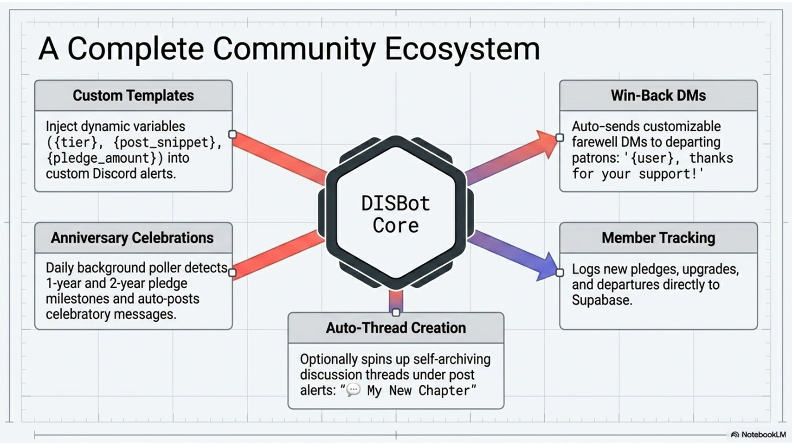
</p>

</details>

<details>
<summary><strong>🎯 Intelligent Tier Detection</strong></summary>

<p align="center">
  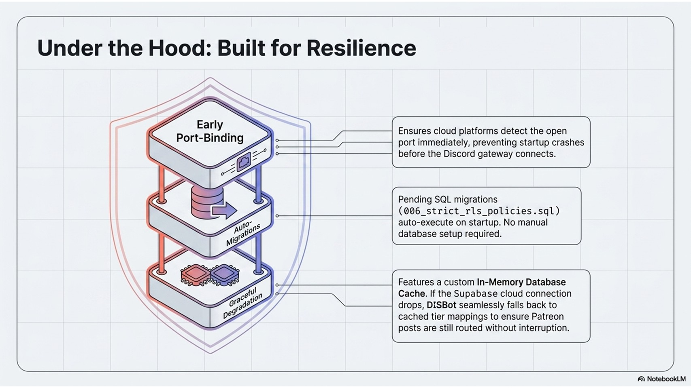
</p>

</details>

<details>
<summary><strong>🔒 Zero-Trust Security Model</strong></summary>

<p align="center">
  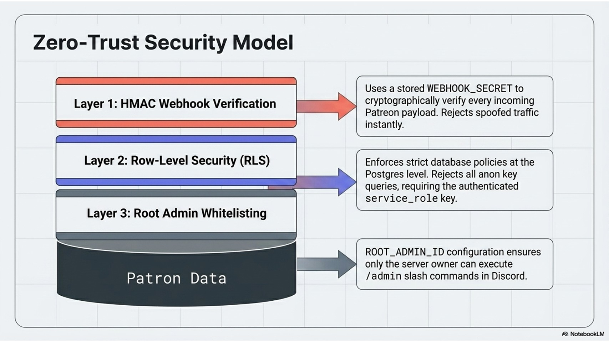
</p>

</details>

<details>
<summary><strong>🖥️ In-Chat Administration</strong></summary>

<p align="center">
  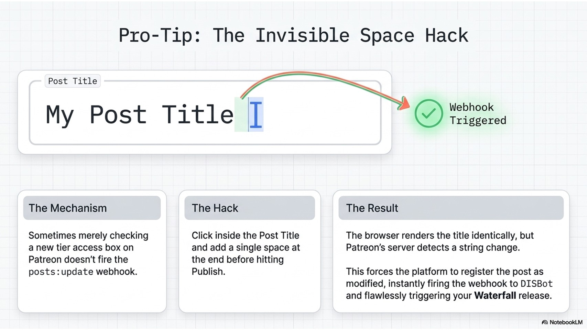
</p>

</details>

<details>
<summary><strong>⚙️ Automated Configuration</strong></summary>

<p align="center">
  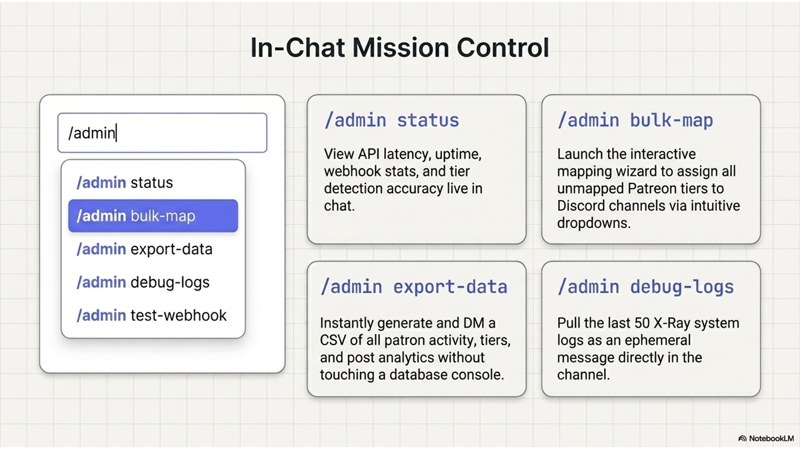
</p>

</details>

<details>
<summary><strong>🏠 Hosting Strategy</strong></summary>

<p align="center">
  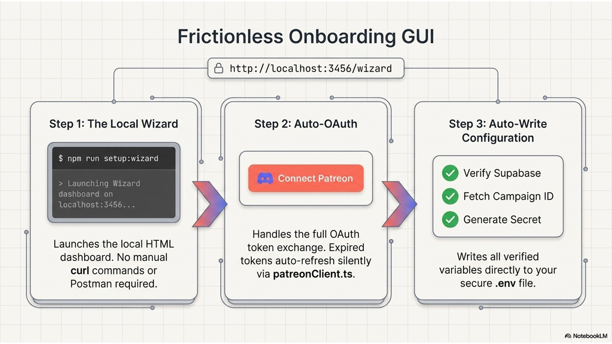
</p>


</details>

<details>
<summary><strong>🚀 Deployment Roadmap</strong></summary>

<p align="center">
  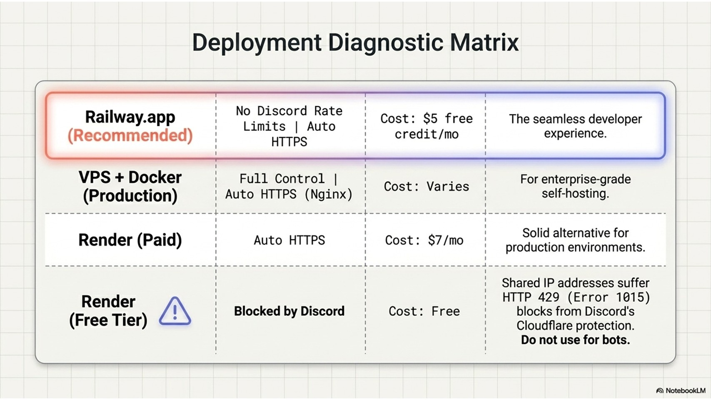
</p>

</details>

<details>
<summary><strong>💡 Pro Tip: The Invisible Space Trick</strong></summary>

<p align="center">
  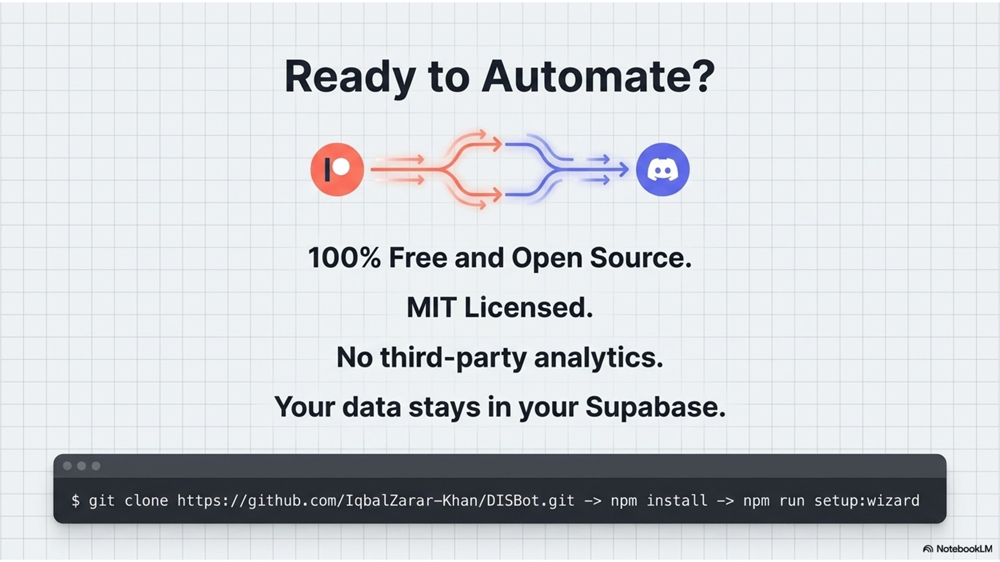
</p>

</details>


## 📝 License

MIT

## 🤝 Support

For issues or questions, please open an issue on GitHub.

## 🙏 Acknowledgments

Built with ❤️ for Patreon creators who want to automate their content distribution workflow.

## 👨‍💻 Made By

**Iqbal Khan**  
[](https://github.com/IqbalZarar-Khan) [](https://www.patreon.com/Fallen_Archangel_)

> I, being a fanfiction translator, wanted to start a Discord Server but was too lazy to handle new chapter releases and updates on Discord for every new chapter and updated chapter. I created this bot to not only do my job but also that of many Patreon Creators.
