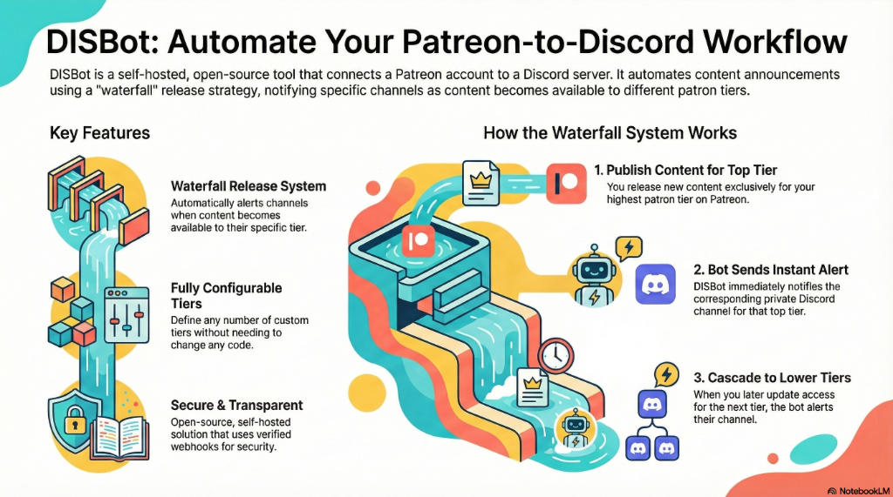

# 🤖 Patreon Tier-Waterfall Discord Bot

A Discord bot that automates content distribution from Patreon to Discord using a tiered "waterfall" release strategy. The bot tracks when content becomes available to different patron tiers and notifies the appropriate Discord channels in real-time.

[](https://railway.com/template/new?referralCode=&repo=IqbalZarar-Khan%2FDISBot)



## ✨ Features

### Core Features
- **🎯 Waterfall Release System**: Automatically alerts Discord channels when content becomes available to their tier
- **⚡ Hybrid Broadcast System**: Sends alerts to ALL channels when posts are released to multiple tiers simultaneously
- **👥 Member Tracking**: Monitors new pledges, upgrades, and departures
- **🔒 Secure Admin Panel**: User ID-based authentication for admin commands
- **📊 Real-time Webhooks**: Instant notifications via Patreon webhooks
- **💎 Tier Management**: Easy mapping of Patreon tiers to Discord channels

### Advanced Features
- **💬 Custom Message Templates**: Fully customizable bot messages with placeholder support (`{tier}`, `{title}`, `{url}`, `{user}`)
- **🗑️ Silent Post Deletion**: Automatically removes deleted posts from database without Discord notifications
- **🔧 Automated Setup**: One-command Patreon tier fetcher using your Creator Access Token (`npm run setup:patreon`)
- **⚙️ Configuration-Driven**: 100% configurable via environment variables (no code changes needed!)
- **🔄 Dynamic Tier System**: Support for any number of custom tiers via JSON configuration
- **🕵️ Debug Logging**: Comprehensive X-Ray debugging for troubleshooting tier detection

## 📚 Documentation

- **[Setup Guide](SETUP.md)** - Detailed setup instructions for Discord, Patreon, and Supabase
- **[Deployment Guide](DEPLOYMENT.md)** - Deploy to Railway, Render, Heroku, VPS, or run locally
- **[Contributing Guide](CONTRIBUTING.md)** - How to contribute to this project
- **[Code of Conduct](CPDSC.md)** - Community guidelines and standards

## 🚀 Quick Start

### Prerequisites

- Node.js 20+ and npm
- A Discord bot token ([Create one here](https://discord.com/developers/applications))
- A Patreon Creator account with OAuth app ([Setup guide](https://www.patreon.com/portal/registration/register-clients))
- A Supabase account ([Sign up here](https://supabase.com))
- A server with HTTPS support for webhooks (Railway, Render, ngrok, etc.)

### Installation

1. **Clone the repository**
   ```bash
   git clone <repository-url>
   cd DISBot
   ```

2. **Install dependencies**
   ```bash
   npm install
   ```

3. **Configure environment variables**
   ```bash
   cp .env.example .env
   # Edit .env with your credentials
   ```

4. **Set up Supabase database**
   - Create a new Supabase project
   - Run the SQL migration from `supabase/migrations/`
   - Copy your Supabase URL and anon key to `.env`

5. **Configure your tiers (Automated Method)**
   
   Set your Creator Access Token in `.env`, then run:
   ```bash
   npm run setup:patreon
   ```
   
   > **How to get the Creator Access Token:** Go to the [Patreon Clients Portal](https://www.patreon.com/portal/registration/register-clients) → click your app → copy the **"Creator's Access Token"** value.
   
   The script will:
   - Fetch your `PATREON_CAMPAIGN_ID` automatically
   - Display a formatted table of all your tiers with prices and patron counts
   - Generate a ready-to-paste `TIER_CONFIG` with **auto-assigned ranks** (highest-priced = 100)
   
   Just copy the output into your `.env` file. Adjust ranks if needed.

6. **Build the project**
   ```bash
   npm run build
   ```

7. **Deploy slash commands**
   ```bash
   npm run deploy-commands
   ```

8. **Start the bot**
   ```bash
   npm start
   # For development with auto-reload:
   npm run dev
   ```

## ⚙️ Configuration

### Environment Variables

Create a `.env` file with the following variables:

```env
# Discord Configuration
DISCORD_TOKEN=your_discord_bot_token
GUILD_ID=your_discord_server_id
ROOT_ADMIN_ID=your_discord_user_id
LOG_CHANNEL_ID=channel_for_logs (optional)

# Patreon Configuration
PATREON_CLIENT_ID=your_patreon_client_id
PATREON_CLIENT_SECRET=your_patreon_client_secret
PATREON_ACCESS_TOKEN=your_patreon_access_token
PATREON_REFRESH_TOKEN=your_patreon_refresh_token
PATREON_CAMPAIGN_ID=your_campaign_id

# Webhook Configuration
WEBHOOK_SECRET=your_webhook_secret
WEBHOOK_PORT=3000

# Supabase Configuration
SUPABASE_URL=https://your-project.supabase.co
SUPABASE_KEY=your_supabase_anon_or_service_key

# Tier Configuration (JSON array)
# Format: [{"name":"TierName","id":"PatreonTierID","rank":RankNumber,"cents":AmountInCents}]
# Rank: 100 = Highest priority, 0 = Free
# cents: Optional pledge amount in cents for fallback tier detection
TIER_CONFIG='[{"name":"Tier1","id":"TIER_ID_1","rank":100,"cents":2500},{"name":"Tier2","id":"TIER_ID_2","rank":75,"cents":1500}]'
```

### Tier Configuration

The bot uses a dynamic tier system configured via the `TIER_CONFIG` environment variable:

**JSON Structure:**
```json
[
  {
    "name": "YourTierName",
    "id": "PatreonTierID",
    "rank": 100,
    "cents": 2500
  }
]
```

- **name**: Tier name used in `/admin set-channel` commands
- **id**: Patreon tier ID (found using tool setup:patreon)
- **rank**: Priority level (100 = highest, 0 = free)
- **cents**: (Optional) Minimum pledge amount in cents for fallback tier detection

**Examples:**

Standard 5-tier setup with cents fallback:
```bash
TIER_CONFIG='[{"name":"Tier1","id":"TIER_ID_1","rank":100,"cents":2500},{"name":"Tier2","id":"TIER_ID_2","rank":75,"cents":1500},{"name":"Tier3","id":"TIER_ID_3","rank":50,"cents":1000},{"name":"Tier4","id":"TIER_ID_4","rank":25,"cents":300},{"name":"Tier5","id":"TIER_ID_5","rank":0,"cents":0}]'
```

Custom tier names:
```bash
TIER_CONFIG='[{"name":"Captain","id":"123","rank":100},{"name":"Crew","id":"456","rank":50}]'
```

### Initial Setup

1. **Invite the bot to your server** with these permissions:
   - Send Messages
   - Embed Links
   - Use Slash Commands

2. **Enable Privileged Gateway Intents** in the [Discord Developer Portal](https://discord.com/developers/applications):
   - ✅ **Server Members Intent** (required)
   - ✅ Message Content Intent (optional)

3. **Configure tier mappings** using `/admin set-channel`:
   ```
   /admin set-channel tier_name:Tier1 channel:#tier1-alerts
   /admin set-channel tier_name:Tier2 channel:#tier2-alerts
   ```

4. **Test the setup**:
   ```
   /admin status
   /admin test-alert tier_name:Tier1
   ```

## 📚 Admin Commands

All admin commands are restricted to the user specified in `ROOT_ADMIN_ID`.

| Command | Description |
|---------|-------------|
| `/admin status` | Display bot status and configuration |
| `/admin set-channel <tier> <channel>` | Map a Patreon tier to a Discord channel |
| `/admin set-message <type> <content>` | Customize bot message templates |
| `/admin set-owner <user>` | Transfer bot control to another user |
| `/admin test-alert <tier>` | Send a test alert to verify setup |

## 🔄 How It Works

### Waterfall Release Strategy

1. **New Content**: When you publish content for Tier1, the bot alerts #tier1-alerts
2. **Tier Update**: When you change access from Tier1 to Tier2, the bot alerts #tier2-alerts
3. **Cascade**: Continue lowering tiers, and each channel gets notified when they gain access

### Tier Detection

The bot uses multiple methods to detect post tiers:

1. **Tier ID Translation**: Converts Patreon tier IDs to tier names using `TIER_CONFIG`
2. **Included Data Lookup**: Searches for tier information in webhook payload
3. **Pledge Amount Fallback**: Uses `min_cents_pledged_to_view` as last resort

### Hybrid Broadcast System

The bot intelligently handles multi-tier post releases:

**BROADCAST Mode** (Multiple Tiers):
- Post released to Diamond + Gold + Silver → All 3 channels get alerts
- Each tier sees their own customized notification
- Perfect for simultaneous multi-tier releases

**STANDARD Mode** (Single Tier):
- Post released to Diamond only → Only #diamond-chat gets alert
- Traditional single-channel notification

**WATERFALL Mode** (Updates):
- Edit post to add lower tiers → Only new tier gets alert
- Prevents spam by only notifying newly-added tiers

**Example:**
```
Day 1: Release to Diamond + Gold
→ Bot sends to #diamond-chat AND #gold-chat (BROADCAST)

Day 7: Edit to add Silver access
→ Bot sends ONLY to #silver-chat (WATERFALL)
```

### Custom Message Templates

Customize all bot messages using the `/admin set-message` command:

**Available Templates:**
- `post_new` - New post notifications
- `post_waterfall` - Waterfall update alerts
- `welcome` - Welcome messages for new patrons

**Placeholders:**
- `{tier}` - Tier name (e.g., "Diamond", "Gold")
- `{title}` - Post title
- `{url}` - Post URL
- `{user}` - User mention (for welcome messages)

**Example:**
```
/admin set-message type:post_new content:🎉 New {tier} exclusive: {title} - {url}
```

### Member Tracking

- **New Pledge**: Bot logs new members and their tier
- **Upgrade**: Bot detects and celebrates tier upgrades
- **Departure**: Bot logs when members end their pledge

## 🛠️ Development

### Project Structure

```
src/
├── commands/           # Slash command handlers
│   ├── admin/         # Admin-only commands
│   │   ├── handler.ts    # Command router
│   │   ├── set-channel.ts
│   │   ├── set-message.ts
│   │   ├── set-owner.ts
│   │   ├── status.ts
│   │   └── test-alert.ts
│   └── deploy-commands.ts
├── database/          # Database layer (Supabase)
│   ├── db.ts         # Database operations
│   ├── schema.ts     # TypeScript interfaces
│   └── supabase.ts   # Supabase client
├── middleware/        # Authorization middleware
│   └── adminCheck.ts
├── utils/            # Utility functions
│   ├── embedBuilder.ts   # Discord embed creation
│   ├── errorHandler.ts   # Error handling
│   ├── formatter.ts      # Message template formatting
│   ├── logger.ts         # Logging (console + Discord)
│   ├── testHelpers.ts    # Webhook test utilities
│   └── tierRanking.ts    # Dynamic tier system
├── webhooks/         # Webhook server and handlers
│   ├── handlers/     # Event-specific handlers
│   │   ├── members-create.ts
│   │   ├── members-update.ts
│   │   ├── members-delete.ts
│   │   ├── members-pledge-create.ts
│   │   ├── members-pledge-update.ts
│   │   ├── members-pledge-delete.ts
│   │   ├── posts-publish.ts
│   │   ├── posts-update.ts
│   │   └── posts-delete.ts
│   ├── server.ts     # Express webhook server
│   └── verify.ts     # HMAC signature verification
├── config.ts         # Configuration management
└── index.ts          # Main entry point
```

### Architecture

The bot follows an **early port-binding** architecture to work correctly on cloud platforms:

1. **Supabase initialization** → Database connection test
2. **Webhook server starts** → Binds to `PORT` immediately (required by Railway/Render)
3. **Discord client login** → Connects to Discord gateway
4. **Ready** → Bot is online and listening for commands + webhooks

This startup order ensures cloud platforms detect the open port before the Discord gateway connection completes.

### Scripts

- `npm run dev` - Start with hot reload
- `npm run build` - Compile TypeScript
- `npm start` - Run production build
- `npm run deploy-commands` - Register slash commands
- `npm test` - Run tests
- `npm run setup:patreon` - Auto-fetch Patreon tier configuration

## 🚢 Deployment

### ⚠️ Important: Hosting Compatibility

> **Render.com free tier does NOT work for Discord bots.** Render's free tier uses shared IP addresses that are rate-limited by Discord's Cloudflare protection (HTTP 429, error code 1015). The bot's gateway connection will hang indefinitely. Use Railway, a paid Render plan, or another platform instead.

### Railway (Recommended)

One-click deploy — click the button below or follow the manual steps.

[](https://railway.com/template/new?referralCode=&repo=IqbalZarar-Khan%2FDISBot)

**Manual steps:**
1. Go to [railway.app](https://railway.app) → Sign in with GitHub
2. **New Project** → **Deploy from GitHub repo** → select your repo
3. Add environment variables in the **Variables** tab
4. Railway auto-detects the `railway.json` config and deploys
5. Generate a domain in **Settings** → **Networking**
6. Update your Patreon webhook URL to `https://your-app.up.railway.app/webhooks/patreon`

**Why Railway?**
- ✅ Automatic HTTPS with free SSL
- ✅ No shared IP rate-limiting issues with Discord
- ✅ $5 free credit/month
- ✅ Fast deploys (~2-3 minutes)
- ✅ Auto-deploy from GitHub pushes

See [DEPLOYMENT.md](DEPLOYMENT.md) for all deployment options.

### Docker Compose (Self-Hosted)

Run everything locally or on your own VPS — **no Supabase Cloud account required**.

Docker Compose bundles PostgreSQL, PostgREST (REST API), and the bot together:

```bash
# 1. Configure
cp .env.example .env        # fill in Discord/Patreon credentials

# 2. Start all services
docker compose up -d

# 3. Register slash commands
docker compose exec bot npm run deploy-commands
```

The database is automatically initialized with all required tables on first start (`docker/init.sql`).

> **Note**: When using Docker Compose, `SUPABASE_URL` and `SUPABASE_KEY` are automatically overridden to point at the local PostgREST instance — you don't need a Supabase Cloud account.

### Docker Only (Bring Your Own Database)

If you already have a Supabase project or external PostgreSQL + PostgREST:

```bash
docker build -t patreon-bot .
docker run -d --env-file .env patreon-bot
```

The Dockerfile uses a multi-stage build with Node.js 20 Alpine for a lean production image.

## 🔐 Security

- **User ID Whitelisting**: Only the root admin can execute admin commands
- **Webhook Verification**: All Patreon webhooks are verified using HMAC signatures
- **Environment Variables**: Sensitive data stored in `.env` (never committed)
- **Supabase RLS**: Row-level security policies protect database access

## ❓ Frequently Asked Questions

### 🛡️ Privacy & Transparency

**Q: Is this bot completely transparent? How do I know it's safe?**

A: Yes. This project is released under the MIT License, which is a permissive open-source license. This means the entire codebase—from the database logic to the webhook handlers—is fully visible and free for you to audit. Nothing is obfuscated or hidden in compiled binaries; what you see in the `src/` folder is exactly what runs on your server.

**Q: Does the bot collect my data or send it to the developer?**

A: No. This is a strictly self-hosted solution.
- **Data Flow**: The bot acts as a direct bridge between your Patreon and your Discord. Data flows from Patreon's webhooks directly to your hosted instance.
- **Storage**: All data, including channel mappings and member tracking, is stored in your Supabase database (PostgreSQL). No data is ever transmitted to the bot creator or any third-party analytics services.

**Q: How is my Patreon data secured?**

A: Security is handled through multiple layers:
1. **Environment Variables**: Sensitive credentials (like your `DISCORD_TOKEN` and `PATREON_ACCESS_TOKEN`) are stored in a `.env` file or your cloud provider's secure environment dashboard. They are never hardcoded into the source code.
2. **Webhook Verification**: The bot uses your `WEBHOOK_SECRET` to verify an HMAC signature on every request. This ensures the bot only accepts data that genuinely comes from Patreon.
3. **Supabase RLS**: Row-level security policies protect your database from unauthorized access.

### ⚙️ Configuration & Tiers

**Q: Is this bot hardcoded for specific tiers like "Diamond" or "Gold"?**

A: No. While the default examples use these names, the system is 100% configuration-driven. You define your own tier hierarchy using a standard JSON format in your environment variables (`TIER_CONFIG`). Whether you have 2 tiers or 20, and whatever you choose to name them, the bot adapts automatically without requiring code changes.

**Q: How does the bot know which tier is which?**

A: It uses a smart "Waterfall" logic with three layers of detection to ensure notifications never fail:
1. **ID Match (Primary)**: It checks the unique Tier ID from Patreon using the `tierIdMap`.
2. **Price Fallback (Secondary)**: If the ID is missing, it checks the `min_cents_pledged_to_view` (e.g., 2500 cents = $25.00) using the `centsMap`.
3. **Title Match (Legacy)**: As a last resort, it attempts to match the tier title text from the `included` data.

**Q: What happens when I update a post (e.g., from "Diamond" to "Gold")?**

A: The bot detects the update and calculates the **lowest** tier that now has access (widest audience). For example, if a post was Diamond-only and you add Gold access, the bot identifies Gold as the new audience and sends the waterfall alert specifically to the Gold channel. This is the core "waterfall" feature.

**💡 Pro Tip: The "Invisible Space" Trick**

Sometimes, when you only change the "Who can access this post?" settings (e.g., checking the box for Gold), Patreon's website may not immediately trigger the `posts:update` webhook. If the webhook isn't sent, the bot cannot detect the change.

**To force the update without altering your content:**
1. Open the Post: Go to the edit screen of your existing post
2. Change Access: Check the box for the new lower tier (e.g., Gold)
3. **The Trick**: Click inside your Post Title and add a single space at the very end
4. Click Update/Publish

**Why this works**: To your readers, "My Post Title" and "My Post Title " look exactly the same—the browser renders them identically. However, Patreon's server sees a difference in the text string. This forces Patreon to mark the post as "modified" and immediately send the `posts:update` signal to your bot, triggering the waterfall logic.

### ☁️ Deployment

**Q: Which hosting platform should I use?**

A: **Railway** is recommended. Here's why:

| Platform | Discord Compatible | Free Tier | HTTPS | Notes |
|----------|-------------------|-----------|-------|-------|
| **Railway** | ✅ Yes | $5 credit/mo | ✅ Auto | **Recommended** |
| **Render (Paid)** | ✅ Yes | ❌ $7/mo+ | ✅ Auto | Works on paid plans |
| **Render (Free)** | ❌ **No** | Free | ✅ Auto | ⚠️ Shared IPs are blocked by Discord |
| **Heroku** | ✅ Yes | 550-1000h | ✅ Auto | Requires credit card |
| **VPS** | ✅ Yes | Varies | Manual | Full control |
| **Local + ngrok** | ✅ Yes | Limited | ✅ Auto | Development only |

> ⚠️ **Render's free tier does NOT work** — Discord/Cloudflare rate-limits the shared IP addresses (HTTP 429, error 1015), causing the bot's gateway connection to hang indefinitely.

**Q: What do I need to get started?**

A: You need:
- Node.js 20+
- A Discord Bot Token ([Create one here](https://discord.com/developers/applications))
- A Patreon Creator account with OAuth app
- A Supabase account (free tier available)
- A server with HTTPS support for webhooks (Railway, VPS, etc.)

See [SETUP.md](SETUP.md) for detailed setup instructions.

## 🆕 Recent Updates

### Latest (Feb 2026)
- ✅ **Railway Deployment**: Railway is now the recommended hosting platform
- ✅ **Node.js 20**: Upgraded from Node 18 to Node 20 (required by Supabase SDK)
- ✅ **Dockerfile Upgrade**: Multi-stage build with Node 20 Alpine, proper dev/prod dependency separation
- ✅ **Early Port Binding**: Webhook server starts before Discord login to prevent cloud platform timeouts
- ✅ **`set-message` Command**: Added missing handler for customizing bot message templates
- ✅ **Render Compatibility Note**: Documented that Render's free tier is blocked by Discord's Cloudflare

### Core Features
- ✅ **Hybrid Broadcast System**: Sends alerts to ALL channels when posts are released to multiple tiers simultaneously
- ✅ **Custom Message Templates**: Fully customizable bot messages with placeholder support (`/admin set-message`)
- ✅ **Silent Post Deletion**: Automatically removes deleted posts from database without Discord notifications
- ✅ **Automated Patreon Setup**: One-command tier configuration fetcher (`npm run setup:patreon`)
- ✅ **X-Ray Debug Logging**: Comprehensive debugging for database operations and tier detection
- ✅ **Edit and Republish Fix**: Correctly handles Patreon's "Edit and Republish" workflow
- ✅ **Dynamic Tier Configuration**: Configure tiers via `TIER_CONFIG` environment variable
- ✅ **Tier ID Translation**: Automatic conversion of Patreon tier IDs to tier names
- ✅ **Supabase Integration**: Persistent PostgreSQL storage via Supabase
- ✅ **Fallback Mechanisms**: Multiple methods to detect post tiers (ID → Cents → Title)

## 📝 License

MIT

## 🤝 Support

For issues or questions, please open an issue on GitHub.

## 🙏 Acknowledgments

Built with ❤️ for Patreon creators who want to automate their content distribution workflow.

## 👨‍💻 Made By

**Iqbal Khan**  
[](https://github.com/IqbalZarar-Khan) [](https://www.patreon.com/Fallen_Archangel_)

> I, being a fanfiction translator, wanted to start a Discord Server but was too lazy to handle new chapter releases and updates on Discord for every new chapter and updated chapter. I created this bot to not only do my job but also that of many Patreon Creators.
