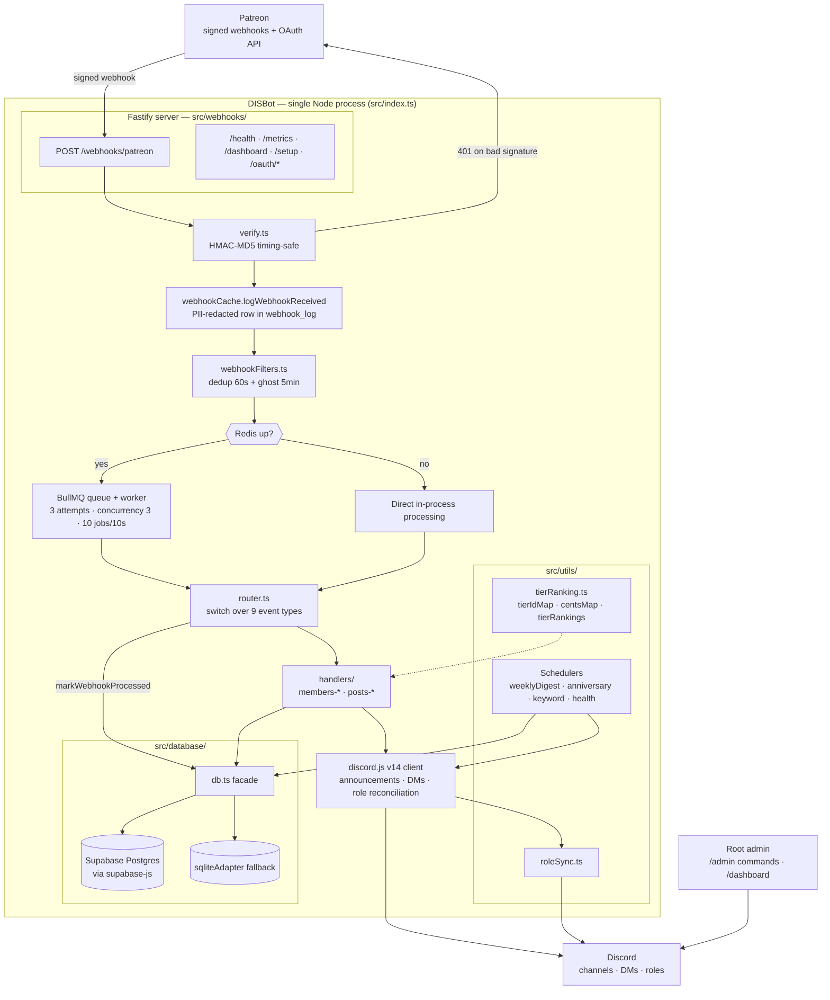
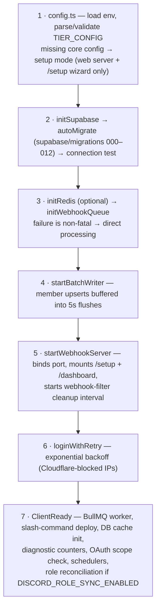
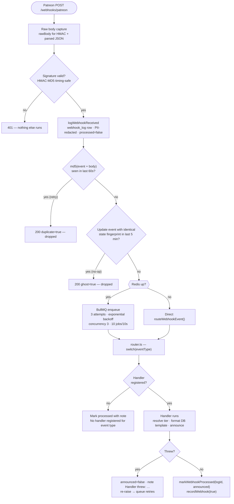
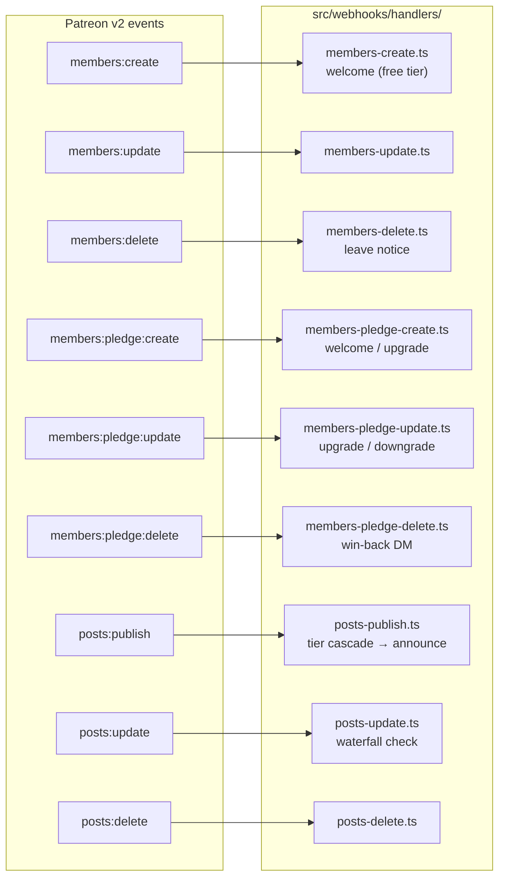
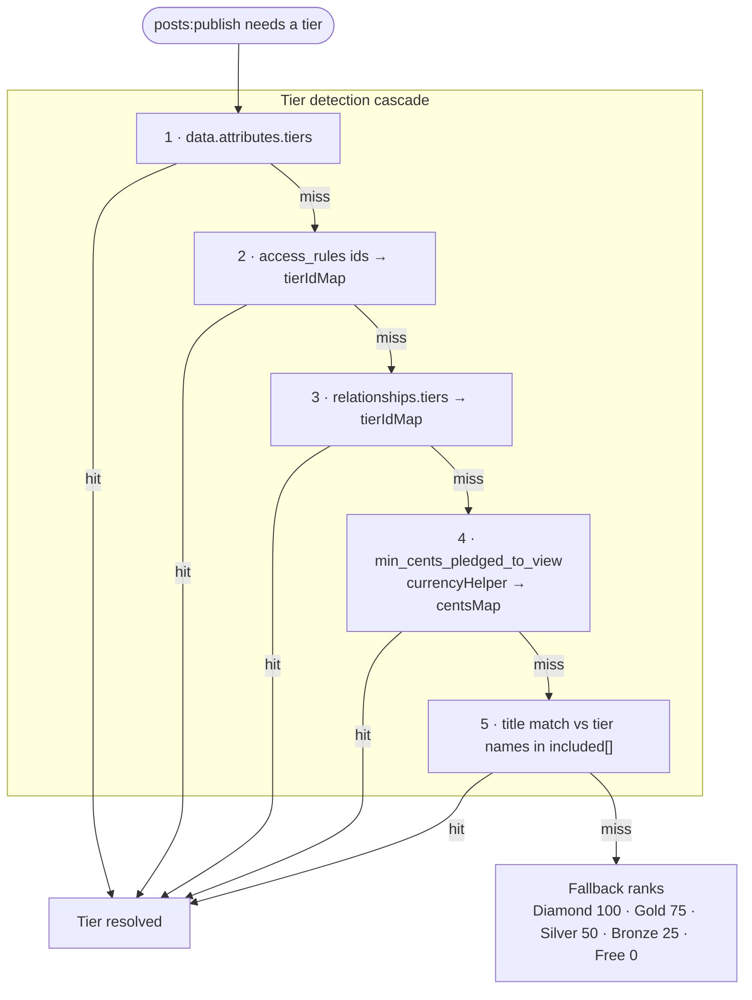
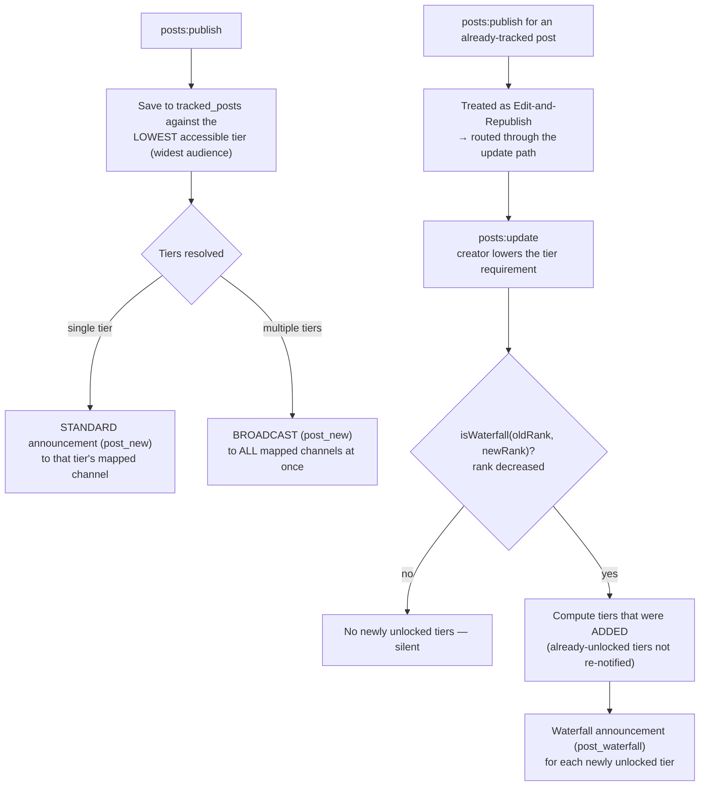
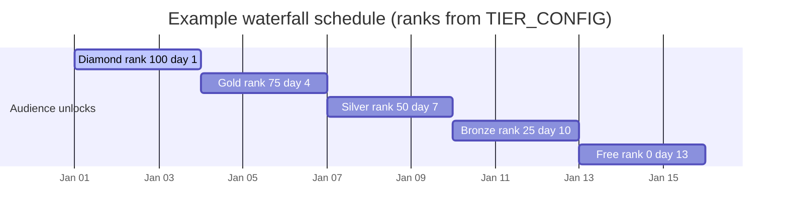
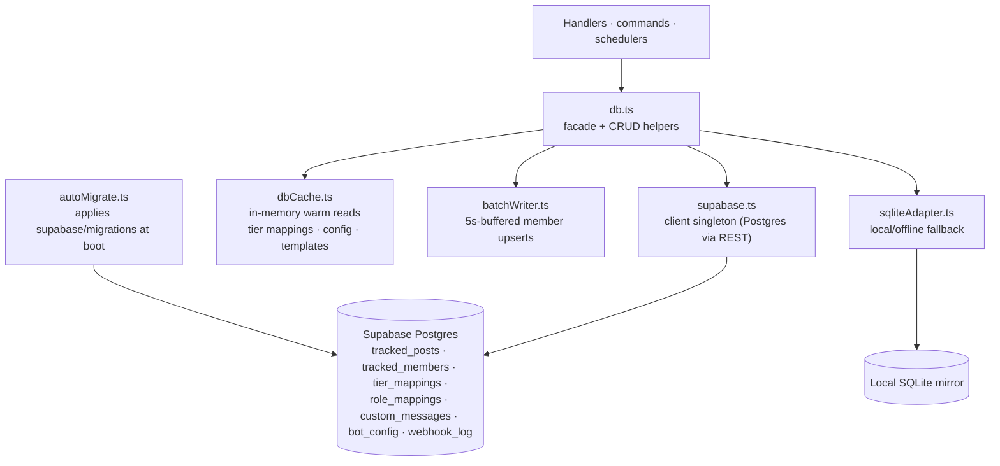
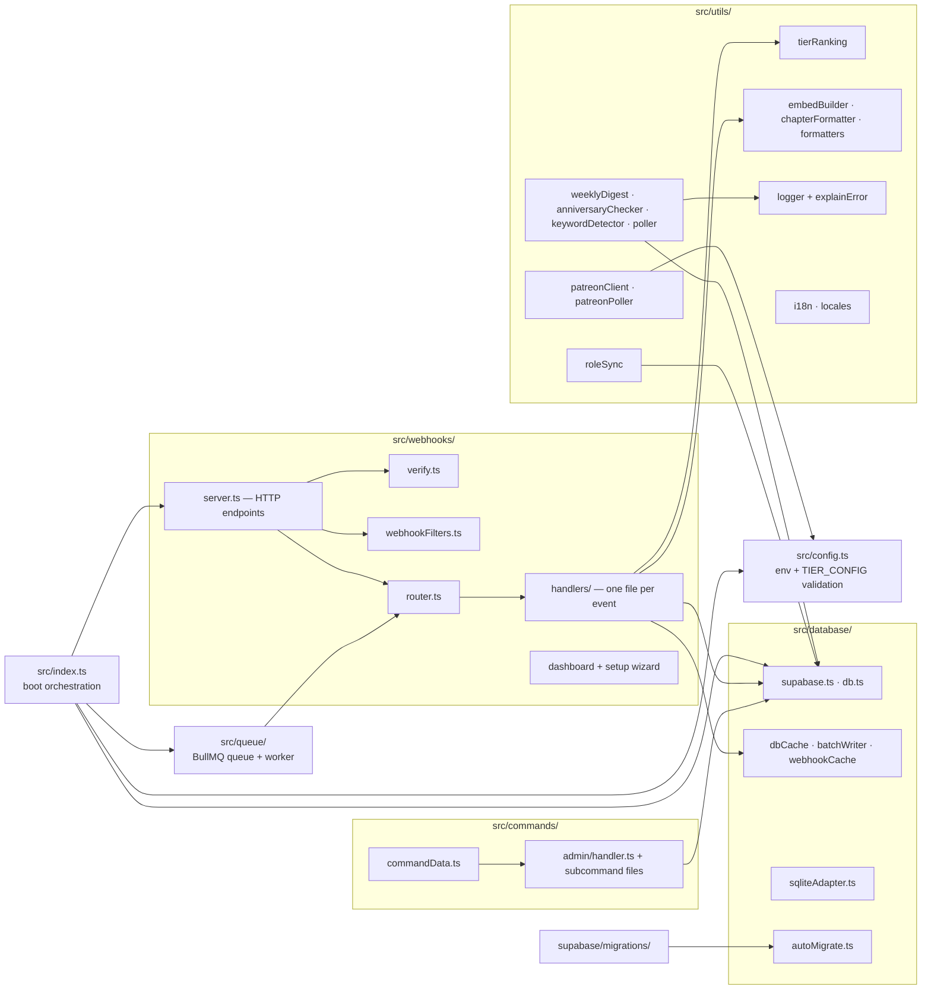

# Diagrams

Visual graphs of how DISBot fits together, distilled from the other wiki pages. All diagrams
are [Mermaid](https://mermaid.js.org) and render natively on GitHub.

- [System overview](#system-overview) — one Node process, three jobs
- [Boot sequence](#boot-sequence) — why the port binds before Discord login
- [Webhook lifecycle](#webhook-lifecycle) — ingress to announcement
- [Event routing](#event-routing) — the nine Patreon events and their handlers
- [Tier detection cascade](#tier-detection-cascade) — five fallback layers
- [Waterfall release](#waterfall-release) — progressive unlock mechanics
- [Data access layers](#data-access-layers) — facade → Supabase / cache / SQLite
- [Module map](#module-map) — who lives where in `src/`

## System overview

One process runs a Discord gateway client, a Fastify webhook server, and background
schedulers. Redis/BullMQ is optional — without it, webhooks are processed in-process
(see [Architecture](Architecture.md)).

## Boot sequence

Order matters: the HTTP port binds **before** the Discord gateway connects so cloud platforms
detect a healthy port during Discord's slow login (see [Architecture](Architecture.md#boot-sequence-srcindexts)).

## Webhook lifecycle

The full ingestion pipeline (see [Webhook Pipeline](Webhook-Pipeline.md)). Steps 4–5 live in
`webhookFilters.ts`; replays via `/admin replay-webhook` intentionally bypass them.

## Event routing

Nine supported Patreon v2 events, one handler each (see
[Webhook Pipeline](Webhook-Pipeline.md#routing-src-webhooksrouterts)). Patreon fires multiple
events per action — handlers dedupe by design:

## Tier detection cascade

`posts-publish.ts` resolves a post's tier through five increasingly desperate layers; every
fallback DMs the admin a warning so silent misrouting stays visible (see
[Tiers & Waterfall](Tiers-and-Waterfall.md#tier-detection-cascade-posts)). Member events use
a similar three-layer resolution: `included[]` → `tierIdMap` → `centsMap`.

## Waterfall release

A chapter goes live for the top tier first, then progressively unlocks for cheaper tiers as
the creator lowers the requirement. Posts are tracked against their **lowest** accessible tier;
only tiers that were *added* get a waterfall announcement (see
[Tiers & Waterfall](Tiers-and-Waterfall.md#waterfall-release)).

Example unlock schedule for a five-tier `TIER_CONFIG`:

## Data access layers

Everything goes through the `db.ts` facade — handlers never touch a client directly (see
[Database](Database.md#access-layers)).

## Module map

Where things live under `src/` (see [Architecture](Architecture.md#module-responsibilities)
for the responsibility table):

